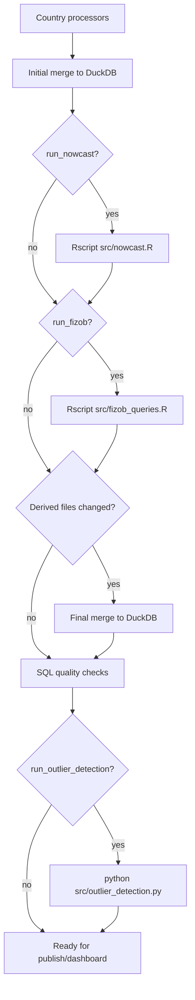

# Оркестрация пайплайна через Prefect 3

Этот документ описывает текущий orchestration-слой вокруг существующих Python/R-скриптов. Цель изменения — сделать порядок запуска явным, убрать ручные повторные прогоны и поставить quality gate перед публикацией базы на дашборд.

## Что добавлено

- `requirements.txt` — фиксирует Python-зависимости проекта, включая `prefect>=3.0,<4.0`.
- `src/orchestration/flows.py` — Prefect flow `mgimo-full-refresh`, который пока запускает существующие CLI/R-команды.
- `src/orchestration/checks.py` — SQL quality checks для итоговой DuckDB-базы.
- `--output-db-path` в `src/merge_processed_data.py` / `src/pipelines/merge_pipeline.py` — позволяет собирать базу не только в `db/unified_trade_data.duckdb`, но и в отдельный артефактный путь.

## Текущий порядок выполнения

Prefect flow намеренно тонкий: бизнес-логика остается в существующих processors, merge pipeline, `nowcast.R` и `fizob_queries.R`. Prefect отвечает за порядок, логи, retry и параметры запуска.



Важный нюанс: если `run_nowcast=True`, первый merge запускается без nowcast (`--no-nowcast`). Это дает R-скрипту nowcast чистую fact-only базу и не подмешивает старый `data_processed/nowcast/nowcast.parquet` из прошлого запуска. После пересчета nowcast и/или fizob flow делает повторный merge, чтобы свежие parquet-артефакты попали в итоговую DuckDB.

## Запуск

Установка зависимостей:

```bash
python -m pip install -r requirements.txt
```

Локальный запуск flow с дефолтными параметрами:

```bash
python src/orchestration/flows.py
```

Пример запуска из Python с пересчетом nowcast и fizob:

```python
from src.orchestration.flows import mgimo_full_refresh

mgimo_full_refresh(
    include_comtrade=True,
    run_nowcast=True,
    run_fizob=True,
    run_quality_checks=True,
    require_fizob_quality=True,
    output_db_path="db/unified_trade_data.duckdb",
)
```

Пример сборки в отдельный файл для проверки перед публикацией:

```python
from src.orchestration.flows import mgimo_full_refresh

mgimo_full_refresh(
    run_nowcast=True,
    run_fizob=True,
    output_db_path="db/unified_trade_data_candidate.duckdb",
)
```

## Параметры flow

- `process_china`, `process_india`, `process_turkey` — запуск страновых processors.
- `include_comtrade` — добавить Comtrade в merge.
- `include_nowcast_in_merge` — включать `data_processed/nowcast/nowcast.parquet` в финальный merge.
- `run_nowcast` — пересчитать nowcast через `Rscript src/nowcast.R`.
- `run_fizob` — пересчитать физобъемы через `Rscript src/fizob_queries.R`.
- `run_quality_checks` — выполнить SQL quality checks после финального merge.
- `require_fizob_quality` — считать `fizob_index` и `fizob_index_v` обязательными в SQL checks.
- `run_outlier_detection` — запустить `src/outlier_detection.py`.
- `start_year` — передается в merge как `--start-year`.
- `output_db_path` — передается в merge как `--output-db-path`; относительный путь считается от корня проекта.
- `rscript` — команда запуска R, по умолчанию `Rscript`.
- `project_root` — корень проекта, по умолчанию определяется автоматически.

## SQL quality checks

Quality gate находится в `src/orchestration/checks.py` и запускается как отдельная Prefect task. Проверки читают DuckDB в read-only режиме и валят flow, если находят проблему.

Проверяется:

- наличие `unified_trade_data`, `unified_trade_data_enriched`, `country_reference`, `tnved_reference`;
- наличие обязательных колонок в `unified_trade_data`;
- непустая основная таблица;
- отсутствие `NULL` в `PERIOD`;
- допустимые значения `NAPR`, `TYPE`, `SOURCE`;
- отсутствие пересечения `TYPE='pred'` с фактом по ключу `(PERIOD, STRANA, TNVED, NAPR)`;
- непустые справочники и enriched view;
- при `require_fizob=True` — наличие и непустота `fizob_index`, `fizob_index_v`.

Ручной запуск checks:

```python
from src.orchestration.checks import run_sql_quality_checks

metrics = run_sql_quality_checks("db/unified_trade_data.duckdb")
print(metrics)
```

## Что еще остается сделать

Текущий слой уже фиксирует порядок и убирает ручную ошибку "забыли второй merge". Следующие полезные шаги:

- параметризовать `src/nowcast.R` и `src/fizob_queries.R` аргументами `--db-path` и `--output-dir`, чтобы они работали с candidate-базой без неявной привязки к `db/unified_trade_data.duckdb`;
- добавить publish-task: atomic upload DuckDB на сервер дашборда после успешных SQL checks;
- сохранять manifest запуска: параметры, версии входных файлов, путь к итоговой базе, метрики checks;
- позже перенести запись nowcast/fizob внутрь DuckDB builder, чтобы полностью убрать parquet-cycle.
