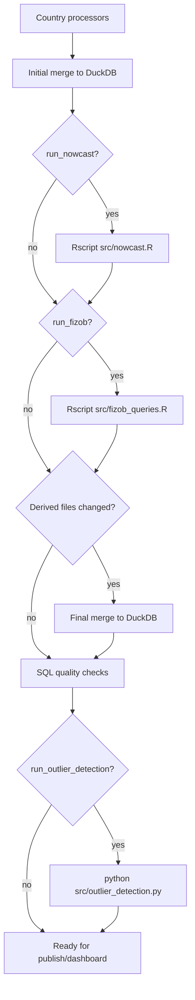

# Оркестрация пайплайна через Prefect 3

Этот документ описывает текущий orchestration-слой вокруг существующих Python/R-скриптов. Цель изменения — сделать порядок запуска явным, убрать ручные повторные прогоны и поставить quality gate перед публикацией базы на дашборд.

## Что добавлено

- `requirements.txt` — фиксирует Python-зависимости проекта, включая `prefect>=3.0,<4.0`.
- `src/orchestration/flows.py` — Prefect flow `mgimo-full-refresh`, который пока запускает существующие CLI/R-команды.
- `src/orchestration/checks.py` — SQL quality checks для итоговой DuckDB-базы.
- `--output-db-path` в `src/merge_processed_data.py` / `src/pipelines/merge_pipeline.py` — позволяет собирать базу не только в `db/unified_trade_data.duckdb`, но и в отдельный артефактный путь.

## Текущий порядок выполнения

Prefect flow намеренно тонкий: бизнес-логика остается в существующих processors, merge pipeline, `nowcast.R` и `fizob_queries.R`. Prefect отвечает за порядок, логи, retry и параметры запуска.



Важный нюанс: если `run_nowcast=True`, первый merge запускается без nowcast (`--no-nowcast`). Это дает R-скрипту nowcast чистую fact-only базу и не подмешивает старый `data_processed/nowcast/nowcast.parquet` из прошлого запуска. После пересчета nowcast и/или fizob flow делает повторный merge, чтобы свежие parquet-артефакты попали в итоговую DuckDB.

## Запуск

Установка зависимостей:

```bash
python -m pip install -r requirements.txt
```

R-зависимости для `run_nowcast=True` и `run_fizob=True`:

```r
install.packages(c("tidyverse", "duckdb", "dfms", "arrow", "vars", "slider"))
```

Для текущей Windows/R установки это можно выполнить из `cmd.exe` так:

```cmd
G:\R\R-4.5.1\bin\Rscript.exe -e "install.packages(c('tidyverse', 'duckdb', 'dfms', 'arrow', 'vars', 'slider'), repos='https://cloud.r-project.org')"
```

`vars` нужен nowcast-шагу через модельную часть `dfms`; если его нет, `src/nowcast.R` падает с ошибкой `нет пакета под названием 'vars'`.

Локальный запуск flow с дефолтными параметрами:

```bash
python src/orchestration/flows.py
```

Этот запуск использует дефолты flow. Он не пересчитывает страновые parquet, nowcast и fizob; он только пересобирает DuckDB из уже существующих parquet-артефактов и запускает SQL quality checks.

## Дефолтное поведение

Дефолтный вызов:

```bash
python src/orchestration/flows.py
```

эквивалентен примерно такому набору параметров:

```python
mgimo_full_refresh(
    process_china=False,
    process_india=False,
    process_turkey=False,
    include_comtrade=True,
    include_nowcast_in_merge=True,
    run_nowcast=False,
    run_fizob=False,
    run_quality_checks=True,
    require_fizob_quality=False,
    run_outlier_detection=False,
    start_year=2019,
    output_db_path=None,
)
```

То есть по умолчанию flow делает:

1. собирает DuckDB через `src/merge_processed_data.py --include-comtrade --start-year 2019`;
2. включает existing nowcast из `data_processed/nowcast/nowcast.parquet`, если файл есть;
3. включает existing fizob parquet из `data_processed/`, если файлы есть;
4. запускает SQL quality checks;
5. пишет результат в `db/unified_trade_data.duckdb`.

По умолчанию flow **не делает**:

- не скачивает новые исходные данные;
- не запускает processors Китая, Индии и Турции;
- не пересчитывает `src/nowcast.R`;
- не пересчитывает `src/fizob_queries.R`;
- не запускает `src/outlier_detection.py`;
- не публикует базу на сервер дашборда.

Это сделано специально: дефолт должен быть быстрым и предсказуемым rebuild/check из текущих артефактов. Любая дорогая работа включается явно.

## Типовые сценарии

### 1. Быстро пересобрать DuckDB из текущих parquet

Если надо только пересобрать базу из уже существующих parquet без пересчета processors, nowcast и fizob:

```bash
python src/orchestration/flows.py
```

Эквивалентный Python-вызов:

```bash
python -c "from src.orchestration.flows import mgimo_full_refresh; mgimo_full_refresh()"
```

Важно: этот сценарий использует existing `data_processed/nowcast/nowcast.parquet` и existing fizob parquet. Для нового месяца это обычно **не финальный production refresh**, потому что derived артефакты могут остаться от прошлого запуска.

### 2. Добавили обработанные parquet за новый месяц

Если `data_processed/*_full.parquet` уже обновлены и надо получить финальную базу для дашборда, запускайте только merge + nowcast + fizob + checks:

```bash
python -c "from src.orchestration.flows import mgimo_full_refresh; mgimo_full_refresh(run_nowcast=True, run_fizob=True, require_fizob_quality=True)"
```

Если Windows не видит `Rscript` в `PATH`, передайте полный путь:

```bash
python -c "from src.orchestration.flows import mgimo_full_refresh; mgimo_full_refresh(run_nowcast=True, run_fizob=True, require_fizob_quality=True, rscript='G:/R/R-4.5.1/bin/Rscript.exe')"
```

Что произойдет:

1. первый merge соберет fact-only базу для R-шагов;
2. `src/nowcast.R` пересчитает `data_processed/nowcast/nowcast.parquet`;
3. `src/fizob_queries.R` пересчитает fizob parquet по строкам `TYPE = 'fact'`;
4. второй merge соберет финальную DuckDB уже с новым nowcast и fizob;
5. SQL checks проверят структуру, допустимые значения и отсутствие пересечения fact/pred.

Если после проверки база готова к публикации, текущий ручной шаг остается внешним к Prefect: загрузить `db/unified_trade_data.duckdb` на сервер дашборда. Publish-task еще не добавлен.

### 3. Добавили сырой месяц для одной страны

Если появился новый сырой файл только для одной страны, запускайте processor только этой страны, а остальные оставляйте выключенными.

Только Турция:

```bash
python -c "from src.orchestration.flows import mgimo_full_refresh; mgimo_full_refresh(process_turkey=True, run_nowcast=True, run_fizob=True, require_fizob_quality=True, rscript='G:/R/R-4.5.1/bin/Rscript.exe')"
```

Только Индия:

```bash
python -c "from src.orchestration.flows import mgimo_full_refresh; mgimo_full_refresh(process_india=True, run_nowcast=True, run_fizob=True, require_fizob_quality=True, rscript='G:/R/R-4.5.1/bin/Rscript.exe')"
```

Только Китай:

```bash
python -c "from src.orchestration.flows import mgimo_full_refresh; mgimo_full_refresh(process_china=True, run_nowcast=True, run_fizob=True, require_fizob_quality=True, rscript='G:/R/R-4.5.1/bin/Rscript.exe')"
```

### 4. Полный refresh всех стран

Полный refresh нужен после изменений в processor-логике, изменения входного контракта или когда надо принудительно пересобрать все страновые parquet:

```bash
python -c "from src.orchestration.flows import mgimo_full_refresh; mgimo_full_refresh(process_china=True, process_india=True, process_turkey=True, run_nowcast=True, run_fizob=True, require_fizob_quality=True, rscript='G:/R/R-4.5.1/bin/Rscript.exe')"
```

Это самый тяжелый режим; для обычного месячного обновления он нужен только если действительно надо заново прогнать processors.

### 5. Собрать candidate-базу перед публикацией

Чтобы не перезаписывать основную `db/unified_trade_data.duckdb`, можно собрать candidate-файл из текущих parquet-артефактов:

```bash
python -c "from src.orchestration.flows import mgimo_full_refresh; mgimo_full_refresh(output_db_path='db/unified_trade_data_candidate.duckdb')"
```

Ограничение текущей версии: `--output-db-path` уже передается в merge, но `src/nowcast.R` и `src/fizob_queries.R` пока читают дефолтную `db/unified_trade_data.duckdb`. Поэтому полностью изолированный candidate-refresh с `run_nowcast=True` и `run_fizob=True` появится после параметризации R-скриптов аргументами `--db-path` и `--output-dir`.

### 6. Проверить уже собранную DuckDB

SQL checks можно запустить отдельно:

```bash
python -c "from src.orchestration.checks import run_sql_quality_checks; print(run_sql_quality_checks('db/unified_trade_data.duckdb'))"
```

Если fizob-таблицы должны быть обязательными:

```bash
python -c "from src.orchestration.checks import run_sql_quality_checks; print(run_sql_quality_checks('db/unified_trade_data.duckdb', require_fizob=True))"
```

## Параметры flow

- `process_china=False`, `process_india=False`, `process_turkey=False` — запуск страновых processors. По умолчанию выключены, чтобы не делать полный апдейт при каждом rebuild.
- `include_comtrade=True` — добавить Comtrade в merge.
- `include_nowcast_in_merge=True` — включать `data_processed/nowcast/nowcast.parquet` в финальный merge.
- `run_nowcast=False` — пересчитать nowcast через `Rscript src/nowcast.R`.
- `run_fizob=False` — пересчитать физобъемы через `Rscript src/fizob_queries.R`.
- `run_quality_checks=True` — выполнить SQL quality checks после финального merge.
- `require_fizob_quality=False` — считать `fizob_index` и `fizob_index_v` обязательными в SQL checks.
- `run_outlier_detection=False` — запустить `src/outlier_detection.py`.
- `start_year=2019` — передается в merge как `--start-year`.
- `output_db_path=None` — передается в merge как `--output-db-path`; относительный путь считается от корня проекта. Если `None`, используется `db/unified_trade_data.duckdb`.
- `rscript="Rscript"` — команда запуска R.
- `project_root=None` — корень проекта, по умолчанию определяется автоматически.

## SQL quality checks

Quality gate находится в `src/orchestration/checks.py` и запускается как отдельная Prefect task. Проверки читают DuckDB в read-only режиме и валят flow, если находят проблему.

Проверяется:

- наличие `unified_trade_data`, `unified_trade_data_enriched`, `country_reference`, `tnved_reference`;
- наличие обязательных колонок в `unified_trade_data`;
- непустая основная таблица;
- отсутствие `NULL` в `PERIOD`;
- допустимые значения `NAPR`, `TYPE`, `SOURCE`;
- отсутствие пересечения `TYPE='pred'` с фактом по ключу `(PERIOD, STRANA, TNVED, NAPR)`;
- непустые справочники и enriched view;
- при `require_fizob=True` — наличие и непустота `fizob_index`, `fizob_index_v`.

Ручной запуск checks:

```python
from src.orchestration.checks import run_sql_quality_checks

metrics = run_sql_quality_checks("db/unified_trade_data.duckdb")
print(metrics)
```

## Что еще остается сделать

Текущий слой уже фиксирует порядок и убирает ручную ошибку "забыли второй merge". Следующие полезные шаги:

- параметризовать `src/nowcast.R` и `src/fizob_queries.R` аргументами `--db-path` и `--output-dir`, чтобы они работали с candidate-базой без неявной привязки к `db/unified_trade_data.duckdb`;
- добавить publish-task: atomic upload DuckDB на сервер дашборда после успешных SQL checks;
- сохранять manifest запуска: параметры, версии входных файлов, путь к итоговой базе, метрики checks;
- позже перенести запись nowcast/fizob внутрь DuckDB builder, чтобы полностью убрать parquet-cycle.
