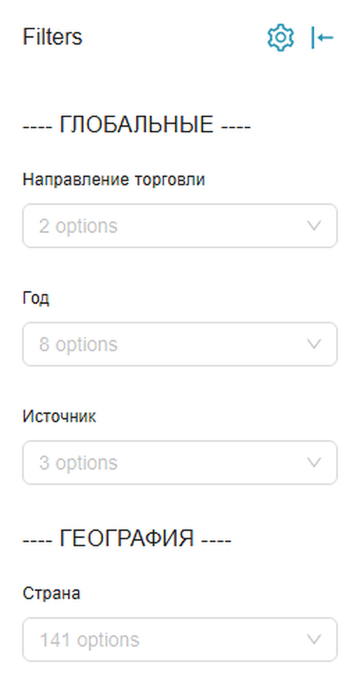

```{r}
#| label: setup
#| include: false

knitr::opts_chunk$set(
  echo = FALSE, message = FALSE, warning = FALSE,
  dev = "svglite", dev.args = list(bg = "transparent"), fig.showtext = FALSE
)

source("scripts/dataviz_helpers.R")
VIZ_FONT <<- viz_register_fonts("fonts")

d  <- viz_data("..")
sp <- viz_spaghetti_data(d)
st <- viz_structure_data(d)
ax <- viz_axis_data(d)
fo <- viz_india_data(d)
ex <- viz_example_data()
```

## План занятия

<ol class="numbered"><li>Пять шагов от таблицы к графику: вопрос, срез, метрика, форма, смысл. Разбираем на данных нашего проекта.</li><li>Что оказалось сложнее, чем ожидалось: особенности сбора торговой статистики и их след в цифрах.</li><li>От отдельного графика к бизнес-аналитике: бюллетень, дашборд, доступ к данным.</li><li>Разбор примеров: запрос к базе и что из него получается.</li></ol>

<div class="qr-block"><span class="qr-text"><b>Материалы проекта</b>База, бюллетень, документация и эта презентация.<span class="url">quantviews.github.io/mgimo-foreign-trade</span></span></div>

::: {.note}
Все пары «хуже / лучше» построены на одних и тех же данных и в одних и тех же осях. Различается только оформление.
:::

## {background-color="#003d7a" .section-slide}

<div class="section-number">01</div>

<div class="section-title">Пять шагов от таблицы к истории</div>

<div class="section-tagline">
Между выгрузкой из базы и фразой «вот что происходит с торговлей» лежит работа, которую не выполняет ни один графический пакет.
</div>

## Вот наши данные

<table class="raw"><thead><tr><th>NAPR</th><th>PERIOD</th><th>STRANA</th><th>TNVED</th><th>EDIZM</th><th>STOIM</th><th>NETTO</th><th>KOL</th><th>SOURCE</th><th>TYPE</th></tr></thead><tbody><tr><td>ИМ</td><td>2024-06-01</td><td>CN</td><td>8402120000</td><td>—</td><td class="num">69 794</td><td class="num">2</td><td class="num">NULL</td><td>national</td><td>fact</td></tr><tr><td>ИМ</td><td>2024-06-01</td><td>CN</td><td>8402900000</td><td>—</td><td class="num">340 757</td><td class="num">98 933</td><td class="num">0</td><td>national</td><td>fact</td></tr><tr><td>ИМ</td><td>2024-06-01</td><td>CN</td><td>8403101000</td><td>—</td><td class="num">11 191 887</td><td class="num">52 614</td><td class="num">NULL</td><td>national</td><td>fact</td></tr><tr><td>ЭК</td><td>2019-01-01</td><td>AD</td><td>2208600000</td><td>—</td><td class="num">6 380,6</td><td class="num">1 380,0</td><td class="num">NULL</td><td>comtrade</td><td>fact</td></tr><tr><td>ИМ</td><td>2019-01-01</td><td>AD</td><td>4202210000</td><td>—</td><td class="num">1 188,8</td><td class="num">12,9</td><td class="num">NULL</td><td>comtrade</td><td>fact</td></tr><tr><td>ИМ</td><td>2024-01-01</td><td>GE</td><td>2204210000</td><td>ЛИТР</td><td class="num">13 272 667</td><td class="num">5 047 930</td><td class="num">5 047 930</td><td>comtrade</td><td>fact</td></tr><tr><td>ЭК</td><td>2026-05-01</td><td>IN</td><td>2709001000</td><td>—</td><td class="num">4 156 717 645</td><td class="num">8 381 065 593</td><td class="num">NULL</td><td>nowcast</td><td>pred</td></tr></tbody></table>

<span class="src">Семь строк из `unified_trade_data`. Вопрос залу: что здесь происходит с российской торговлей — она растёт или падает?</span>

## Почему таблицу не читают

<div class="facts"><div><span class="fig">7 416 603</span><span class="cap">строки в базе</span></div><div><span class="fig">141</span><span class="cap">страна-партнёр</span></div><div><span class="fig">17 793</span><span class="cap">кода ТН ВЭД</span></div><div><span class="fig">90</span><span class="cap">месяцев, 2019–2026</span></div></div>

В таблице не читают, а ищут, и для поиска нужно заранее знать, что искать. Глаз при этом хорошо оценивает длину, положение и направление, но плохо — числа. Визуализация переводит данные из первого режима во второй.

Отсюда простое следствие: график отвечает на вопрос «что происходит», таблица — на вопрос «чему равно». Обе формы нужны, и подменять одну другой не стоит.

## Пять шагов

<ol class="numbered"><li><strong>Вопрос.</strong> На что должен ответить график: объект, метрика, период, база сравнения.</li><li><strong>Срез.</strong> Какие строки берём и на каком уровне детализации сворачиваем.</li><li><strong>Метрика.</strong> Что измеряем: доллары, тонны или расчётный индекс.</li><li><strong>Форма.</strong> Какой тип графика отвечает на такой тип вопроса.</li><li><strong>Смысл.</strong> Заголовок, акцент, обозначение того, чего в данных нет.</li></ol>

::: {.note}
Порядок здесь существенный. Большинство неудачных графиков — это четвёртый шаг, сделанный без первых трёх.
:::

## Шаг 1. Вопрос

<div class="steps"><span class="now">вопрос</span> · срез · метрика · форма · смысл</div>

::: {.lead}
Рабочая формулировка содержит объект, метрику, период и базу сравнения. Всё, чего в ней не хватает, вы додумаете за читателя.
:::

<ol class="numbered"><li>«Покажи данные по Китаю». Не заданы ни период, ни метрика, ни направление торговли. <em>Лучше:</em> как изменился физический объём импорта из Китая за последние 12 месяцев по сравнению с предыдущими двенадцатью.</li><li>«Растёт ли торговля». Торговля чем, с кем и в чём измеренная. <em>Лучше:</em> в каких товарных группах экспорт в Индию сократился в тоннах сильнее всего за последний год.</li><li>«Сделай дашборд по внешней торговле». Нет адресата и нет решения, которое он принимает. <em>Лучше:</em> аналитику нужно каждый месяц видеть партнёров, у которых поставки отклонились от прошлого года более чем на 15%.</li></ol>

## Тип вопроса задаёт форму

<table class="plain"><thead><tr><th>Вопрос звучит как…</th><th>Что показываем</th><th>Форма</th></tr></thead><tbody><tr><td>Как менялось со временем</td><td>динамику одной или нескольких величин</td><td>линия, площадь</td></tr><tr><td>Кто больше, кто меньше</td><td>сравнение категорий между собой</td><td>отсортированные горизонтальные столбцы</td></tr><tr><td>Из чего это состоит</td><td>вклад частей в целое</td><td>столбцы с накоплением</td></tr><tr><td>Связано ли одно с другим</td><td>две величины по одним объектам</td><td>точечная диаграмма</td></tr><tr><td>Чему равно вот это конкретно</td><td>точные значения, которые будут копировать</td><td>таблица</td></tr></tbody></table>

::: {.note}
Последняя строка не менее важна, чем остальные. Если читателю нужно точное число, чтобы перенести его в отчёт, таблица быстрее и честнее графика.
:::

## Шаг 2. Срез

<div class="steps">вопрос · <span class="now">срез</span> · метрика · форма · смысл</div>

::: {.lead}
Как менялась стоимость импорта из Китая в долларах с 2024 года?
:::

```sql
SELECT PERIOD, TNVED2, SUM(STOIM) AS import_usd   -- TNVED2 / TNVED4 / TNVED6 / TNVED
FROM unified_trade_data
WHERE STRANA = 'CN' AND NAPR = 'ИМ' AND TYPE = 'fact'
  AND PERIOD >= DATE '2024-01-01'
GROUP BY 1, 2
```

<table class="plain"><thead><tr><th>Уровень</th><th>Кодов в срезе</th><th>Строк в ответе</th><th>Сумма импорта</th><th>Что с этим можно делать</th></tr></thead><tbody><tr><td>ТН ВЭД-2</td><td>98 товарных групп</td><td>2 902</td><td>279,9 млрд $</td><td>помещается на один график</td></tr><tr><td>ТН ВЭД-4</td><td>1 097 позиций</td><td>28 499</td><td>279,9 млрд $</td><td>уже только таблица</td></tr><tr><td>ТН ВЭД-6</td><td>4 447 субпозиций</td><td>104 972</td><td>279,9 млрд $</td><td>только поиск по коду</td></tr><tr><td>полный код</td><td>6 760 позиций</td><td>147 120</td><td>279,9 млрд $</td><td>это выгрузка, а не срез</td></tr></tbody></table>

::: {.concl}
Ответить можно на четырёх уровнях детализации: запрос отличается одним словом, а сумма импорта во всех четырёх случаях одна и та же. Меняется только подробность разбивки, поэтому уровень выбирают под то, что читатель способен удержать: 98 групп можно обсудить вслух, 6 760 кодов — только искать в них нужную позицию.
:::

## Что делать с 98 товарными группами

:::: {.pair}

::: {.c}
[как получается по умолчанию]{.lbl}

```{r}
#| fig-width: 6.0
#| fig-height: 4.4
p_spaghetti_bad(sp)
```

[Формально показаны все 98 групп. Практически не читается ни одна, а легенда занимает треть площади.]{.cap}
:::

::: {.c}
[после выбора истории]{.lbl}

```{r}
#| fig-width: 6.6
#| fig-height: 4.4
p_spaghetti_good(sp)
```

[Те же 98 групп и та же ось. Три линии вынесены вперёд, остальные оставлены фоном: контекст сохранён, а история появилась.]{.cap}
:::

::::

::: {.note}
Изменились три вещи: остальные 95 групп обесцвечены, но не удалены; названия стоят рядом с линиями, а не в легенде; пунктир на уровне единицы задаёт базу сравнения.
:::

## Шаг 3. Метрика

<div class="steps">вопрос · срез · <span class="now">метрика</span> · форма · смысл</div>

::: {.solo}
```{r}
#| fig-width: 11.6
#| fig-height: 4.6
p_usd_vs_volume(d)
```
:::

::: {.note}
В 2022 году экспорт вырос на 70% в долларах и одновременно сократился в тоннах. Оба числа верны. Пока метрика не выбрана, у вопроса «выросла торговля или упала» нет ответа.
:::

## Почему нельзя просто сложить количество

Единицы измерения внутри товарной группы 27 (топливо), поле `KOL`:

<table class="raw"><thead><tr><th>EDIZM — единица измерения</th><th>строк</th><th>SUM(KOL)</th></tr></thead><tbody><tr><td>КУБИЧЕСКИЙ МЕТР</td><td class="num">693</td><td class="num">999 798 580 882</td></tr><tr><td>ЛИТР</td><td class="num">1 823</td><td class="num">76 284 555 781</td></tr><tr><td>1000 КИЛОВАТТ-ЧАС</td><td class="num">693</td><td class="num">52 341 503</td></tr><tr><td>1000 ЛИТРОВ</td><td class="num">153</td><td class="num">4 944 499</td></tr><tr><td>1000 КУБИЧЕСКИХ МЕТРОВ</td><td class="num">35</td><td class="num">46 918 572</td></tr><tr><td>КВАДРАТНЫЙ МЕТР</td><td class="num">1</td><td class="num">1 324 000 000</td></tr><tr><td>ШТУКА</td><td class="num">10</td><td class="num">23 825</td></tr><tr><td>МЕТР</td><td class="num">1</td><td class="num">9 007</td></tr></tbody></table>

<span class="src">`SUM(KOL)` по группе 27 складывает кубометры с киловатт-часами и квадратными метрами. SQL выполнит это и вернёт число; на графике оно будет неотличимо от осмысленного.</span>

## Индекс физического объёма

:::: {.cols-3}

::: {.c}
[Нужной метрики в данных нет]{.ch}
Стоимость в долларах есть всегда, но она смешивает цену и объём. Натуральные единицы есть, но несопоставимы между собой.
:::

::: {.c}
[Как считаем]{.ch}
Каждую позицию нормируем к её базовому периоду, агрегируем уже безразмерные величины, скользящее окно в 12 месяцев снимает сезонность.
:::

::: {.c}
[Что это даёт]{.ch}
Появляется ответ на вопрос «груза стало больше или меньше» — по любой стране и любому уровню ТН ВЭД. В TradeMap и Comtrade такого показателя нет.
:::

::::

::: {.concl}
Метрику не всегда выбирают из готовых, иногда её приходится построить. Это часть работы над графиком, а не отдельная математика до неё.
:::

## Метрику диктуют данные

<div class="facts"><div><span class="fig">100%</span><span class="cap">строк имеют стоимость STOIM</span></div><div><span class="fig">91%</span><span class="cap">фактических строк имеют вес нетто NETTO</span></div><div><span class="fig">22%</span><span class="cap">фактических строк имеют количество KOL</span></div></div>

График, построенный на `KOL`, молча отбросит три четверти торговли и никак этого не покажет. Пропуски вообще не видны на картинке: линия просто идёт ниже, и выглядит это как сокращение поставок.

Поэтому индекс в проекте считается на `NETTO`, а `KOL` используется там, где он заполнен. Перед тем как строить график, полезно отдельно посчитать, сколько строк отвалилось на выбранном срезе.

## Шаг 4. Форма

<div class="steps">вопрос · срез · метрика · <span class="now">форма</span> · смысл</div>

:::: {.pair}

::: {.c}
[пирог]{.lbl}

```{r}
#| fig-width: 5.9
#| fig-height: 4.3
p_pie_bad(st)
```

[Сегменты 7,0% и 6,6% на глаз неразличимы, порядок алфавитный, а на каждый сегмент нужен отдельный взгляд в легенду.]{.cap}
:::

::: {.c}
[столбцы]{.lbl}

```{r}
#| fig-width: 6.6
#| fig-height: 4.3
p_bar_good(st)
```

[Длина сравнивается точнее угла, сортировка задаёт порядок чтения, доли подписаны, цветом выделено то, о чём идёт речь.]{.cap}
:::

::::

::: {.note}
Пирог уместен, когда частей две-три и вопрос звучит как «больше или меньше половины». Десять сегментов — почти всегда ошибка.
:::

## Ровная линия обычно что-то скрывает

:::: {.pair}

::: {.c}
[итог]{.lbl}

```{r}
#| fig-width: 5.9
#| fig-height: 4.3
p_aggregate_bad(d)
```

[По этому графику вывод такой: в 2022 году был пик, затем спад, сейчас около 31 млрд долларов. Всё верно и мимо главного.]{.cap}
:::

::: {.c}
[по странам-получателям]{.lbl}

```{r}
#| fig-width: 6.6
#| fig-height: 4.3
p_decomposed_good(d)
```

[Те же числа в разбивке. Итог почти не изменился, состав торговли изменился полностью.]{.cap}
:::

::::

::: {.note}
Практическое правило: увидели ровную линию — разложите её хотя бы по одному измерению. Стабильный итог часто складывается из двух тенденций, которые компенсируют друг друга.
:::

## Ось решает, что читатель увидит

:::: {.pair}

::: {.c}
[ось обрезана]{.lbl}

```{r}
#| fig-width: 5.9
#| fig-height: 4.0
p_axis_bad(ax)
```

[Ось начинается с 22 млрд долларов. Столбцы отличаются в разы визуально и на 30% фактически.]{.cap}
:::

::: {.c}
[ось от нуля]{.lbl}

```{r}
#| fig-width: 5.9
#| fig-height: 4.0
p_axis_good(ax)
```

[Те же числа. Снижение видно, но в реальном масштабе: как колебание внутри коридора, а не как обвал.]{.cap}
:::

::::

::: {.note}
Столбцы читаются по длине, поэтому ноль на оси им нужен обязательно. Линия читается по наклону, и для неё обрезанная ось допустима, но тогда её следует подписать.
:::

## Цвет

:::: {.cols-3}

::: {.c}
[Цвет должен что-то означать]{.ch}
Цвет ставят там, где он кодирует категорию, знак или акцент. Раскрашивать всё подряд — то же самое, что выделить жирным весь текст.
:::

::: {.c}
[Больше пяти цветов не работают]{.ch}
Человек надёжно различает пять-семь цветов, дальше начинается сверка с легендой. Остальное уводят в серый, в отдельные панели или в таблицу.
:::

::: {.c}
[Проверка в градациях серого]{.ch}
Около 8% мужчин не различают красный и зелёный, а проектор искажает цвета. График, который читается в чёрно-белом виде, читается везде.
:::

::::

::: {.note}
В проекте это закреплено палитрой: синий МГИМО для основной линии, красный для акцента и отрицательных значений, зелёный для положительных, серый для контекста.
:::

## Шаг 5. Смысл

<div class="steps">вопрос · срез · метрика · форма · <span class="now">смысл</span></div>

:::: {.pair}

::: {.c}
[заголовок описывает]{.lbl}

```{r}
#| fig-width: 5.9
#| fig-height: 4.1
p_title_before(fo)
```

[Заголовок пересказывает оси, три линии равноправны, названия рядов взяты из полей базы. Вывод предлагается сделать читателю.]{.cap}
:::

::: {.c}
[заголовок объясняет]{.lbl}

```{r}
#| fig-width: 6.6
#| fig-height: 4.1
p_title_after(fo)
```

[Те же данные и те же оси. Заголовок называет вывод, цвет ведёт к нему взгляд, подпись стоит там, куда читатель смотрит.]{.cap}
:::

::::

::: {.note}
Проверка простая: закройте график и прочитайте один заголовок. «Динамика показателя за период» этот тест не проходит.
:::

## Прогноз должен выглядеть как прогноз

::: {.solo}
```{r}
#| fig-width: 11.6
#| fig-height: 4.4
p_nowcast(d)
```
:::

::: {.note}
Таможенные данные приходят с лагом, поэтому последние месяцы в базе — оценка модели, помеченная флагом `TYPE = 'pred'`. На графике эта пометка должна быть видна: другой цвет, пунктир, подсветка области.
:::

## Чек-лист перед публикацией

<ol class="hang two"><li><strong>Вопрос сформулирован</strong>объект, метрика, период, база сравнения</li><li><strong>Известно, что отвалилось</strong>сколько строк потерял срез и почему</li><li><strong>Метрика названа явно</strong>доллары, тонны или индекс — и это написано</li><li><strong>Форма соответствует вопросу</strong>динамика линией, сравнение столбцами</li><li><strong>У столбцов ось от нуля</strong>у линии обрезанная ось подписана</li><li><strong>Заголовок объясняет</strong>а не пересказывает подписи осей</li><li><strong>Цветов не больше пяти</strong>остальное серым, контекстом</li><li><strong>Источник и дата указаны</strong>видно, где факт, а где оценка</li></ol>

## {background-color="#003d7a" .section-slide}

<div class="section-number">02</div>

<div class="section-title">Что оказалось сложнее, чем ожидалось</div>

<div class="section-tagline">
Прежде чем данные попадут на график, их нужно получить. На этом этапе нас ждало несколько неожиданностей, о которых стоит рассказать отдельно.
</div>

## Данные не отдают, их добывают

:::: {.cols-3}

::: {.c}
[Китай]{.ch}
Портал таможенной службы закрыт капчей, которую приходится решать вручную. Сбор устроен как полуавтомат: скрипт открывает браузер, оператор заполняет форму и скачивает файл, дальше обработка идёт сама.

Выгрузку легко получить в юанях вместо долларов, поэтому валюта проверяется отдельно.
:::

::: {.c}
[Индия]{.ch}
Открытого API нет, есть форма с CSRF-токеном, который нужно получать отдельным запросом. Ответ приходит HTML-страницей и разбирается парсером.

Стоимость в долларах, стоимость в рупиях и количество — три независимых запроса, результаты склеиваются по коду товара.
:::

::: {.c}
[Турция]{.ch}
Данные отдаёт форма на устаревшем фреймворке, ответ — набор HTML-страниц по кодам ТН ВЭД.

Числа записаны в европейском формате `1.234,56`, где точка разделяет тысячи. Прочитанные как есть, они дают ошибку в тысячу раз.
:::

::::

::: {.note}
Направление торговли у всех трёх источников приходится зеркалить: экспорт Китая в Россию — это российский импорт. Ошибка здесь переворачивает картину целиком.
:::

## Пустая таблица и таблица из нулей

Индийская база возвращает структуру таблицы и для тех месяцев, которые ещё не опубликованы: строки на месте, суммы нулевые. Формально ответ корректен, и без проверки такой месяц попал бы в базу как месяц с нулевой торговлей.

На графике это выглядело бы не как отсутствие данных, а как обвал поставок до нуля с последующим восстановлением — то есть как содержательный экономический сюжет.

::: {.concl}
Сейчас перед записью проверяется сумма по месяцу: если `STOIM` и `KOL` в сумме дают ноль, месяц не сохраняется. Проверок такого рода в пайплайне около десятка, и почти каждая появилась после разбора конкретной странности в данных.
:::

## Ответ обрезается молча

Comtrade принимает параметр `maxRecords`, который ограничивает размер ответа. Признака обрезки в ответе нет, а поле `count` содержит число возвращённых строк, а не действительное их количество.

С исходным лимитом в 50 000 строк экспорт Германии упирался в потолок в 38 парах «страна-месяц». За февраль 2020 года в файл попало ровно 50 000 строк при фактических 61 078 — потери около 18% без единого сообщения об ошибке.

::: {.concl}
Диагностика оказалась простой: искать месяцы, где число строк в точности равно лимиту. Сейчас лимит 250 000, а совпадение с ним трактуется как обрезка — пачка делится пополам и запрашивается заново.
:::

## Данные меняются задним числом

<table class="plain"><thead><tr><th>Месяц</th><th>Стран в нашем файле</th><th>Доступно в источнике</th><th>Пересмотрели после загрузки</th></tr></thead><tbody><tr><td>июнь 2019</td><td>119</td><td>129</td><td>1</td></tr><tr><td>июнь 2023</td><td>120</td><td>120</td><td>9</td></tr><tr><td>июнь 2025</td><td>68</td><td>95</td><td>51</td></tr></tbody></table>

Страны досылают и правят отчётность годами. Январь 2024 года у Андорры впервые опубликован в феврале 2024-го, а последний раз правился в августе 2026-го.

::: {.concl}
Привычное правило «перекачивать последние N месяцев» здесь не работает: глубина пересмотра разная от месяца к месяцу, а пропуски встречаются и в данных 2019 года. Пришлось хранить рядом с выгрузкой манифест: по каждому месяцу — какие страны в нём есть и какая у их данных контрольная сумма.
:::

## Цена одной буквы

Китай в одном из скриптов записывался кодом `CH`, а в другом — `CN`. В справочнике Comtrade `CH` — это Швейцария.

При сборке базы действует правило: если по стране есть национальная статистика, данные Comtrade по ней не берутся. Из-за расхождения в коде из выгрузки исключалась Швейцария, а Китай не исключался, и китайские данные попадали в базу дважды — из национального источника и из Comtrade.

::: {.concl}
На графике удвоение не выглядит как ошибка: линия просто идёт выше. Заметить это можно только сверкой с внешним источником или проверкой на уровне данных — поэтому в проекте есть отдельный набор тестов качества, которые считают такие вещи после каждой пересборки.
:::

## Что из этого следует для графика

Ни одна из перечисленных проблем не оставляет следа на картинке. Обрезанный ответ, неопубликованный месяц, задвоенная страна, перепутанное направление — всё это даёт нормально выглядящую линию, которая идёт не туда.

Поэтому вопрос «откуда взялась эта цифра» — не бюрократическая формальность, а часть работы с визуализацией. В базе у каждой записи хранится источник (`SOURCE`) и тип (`TYPE`), а сборка сопровождается тестами качества.

::: {.concl}
Практический вывод для аналитика: прежде чем объяснять необычное движение на графике экономическими причинами, стоит проверить, не объясняется ли оно способом сбора данных.
:::

## {background-color="#003d7a" .section-slide}

<div class="section-number">03</div>

<div class="section-title">От графика к бизнес-аналитике</div>

<div class="section-tagline">
Отдельный хороший график — разовый результат. Бизнес-аналитика начинается там, где он воспроизводится каждый месяц без участия автора.
</div>

## Четыре уровня

<ol class="hang"><li><strong>Разовый график <em>— Excel, ноутбук, скриншот в презентацию</em></strong>Отвечает на вопрос один раз. Через месяц данные обновились, и всё нужно повторять руками. Как именно это было сделано, помнит только автор.</li><li><strong>Воспроизводимый отчёт <em>— Quarto-бюллетень проекта</em></strong>График описан кодом. Пересчёт — одна команда, результат идентичен. Появляется история изменений и возможность проверить, откуда взялась цифра.</li><li><strong>Дашборд <em>— Superset поверх DuckDB</em></strong>Читатель сам меняет период, страну и товарную группу. Автор отвечает не на один вопрос, а на класс вопросов, и перестаёт быть нужным для каждого среза.</li><li><strong>Доступ к данным <em>— API проекта, выгрузка в Excel и Power Query</em></strong>Пользователь строит свои графики в своём инструменте. В каком-то смысле это высшая форма визуализации: её делает уже не аналитик, а сам потребитель.</li></ol>

## Отчёт и дашборд решают разные задачи

<table class="plain"><thead><tr><th></th><th>Отчёт, бюллетень</th><th>Дашборд</th></tr></thead><tbody><tr><td>Задача</td><td>рассказать историю</td><td>дать возможность найти свою</td></tr><tr><td>Автор вывода</td><td>аналитик</td><td>читатель</td></tr><tr><td>Порядок чтения</td><td>задан автором, сверху вниз</td><td>произвольный, от фильтра</td></tr><tr><td>Сколько вопросов</td><td>один-два, раскрытых глубоко</td><td>класс похожих вопросов</td></tr><tr><td>Заголовки</td><td>содержательные: «экспорт сменил адрес»</td><td>нейтральные: «экспорт по странам»</td></tr><tr><td>Частота</td><td>выпуск раз в месяц</td><td>работает постоянно</td></tr><tr><td>Типичная неудача</td><td>простыня графиков без вывода</td><td>тридцать чартов и ни одного фильтра</td></tr></tbody></table>

::: {.note}
Распространённая ошибка — сделать отчёт и назвать его дашбордом: набор статичных графиков с выводами в заголовках, по которому нельзя построить ни одного собственного среза.
:::

## Дашборд проекта

::: {.lead}
`Внешняя торговля РФ` — пять вкладок поверх одной таблицы. Открывается по адресу инстанса, доступ выдаётся отдельно.
:::

<table class="plain"><thead><tr><th>Вкладка</th><th>На какой вопрос отвечает</th><th>Чем показано</th></tr></thead><tbody><tr><td>Обзор</td><td>что со стоимостью и объёмом торговли в целом</td><td>итог за 12 месяцев, помесячная динамика, наукаст</td></tr><tr><td>География</td><td>как торговля распределена по странам</td><td>области в долларах и в килограммах</td></tr><tr><td>Продукты</td><td>какие товарные группы дают основной объём</td><td>treemap по ТН ВЭД и таблица</td></tr><tr><td>Покрытие</td><td>по каким странам и периодам данные вообще есть</td><td>матрица покрытия</td></tr><tr><td>Физобъемы</td><td>больше или меньше стало груза</td><td>индексы по странам и группам</td></tr></tbody></table>

::: {.note}
Дашборд построен не на самой `unified_trade_data`, а на представлении `unified_trade_data_enriched`: в нём к каждой строке уже присоединены русские названия страны и товарного кода. Иначе читателю пришлось бы работать с `CN` и `8403101000` вместо «Китая» и «котлов центрального отопления».
:::

## Фильтры: срез делает читатель

:::: {.pair}

::: {.c}
[панель фильтров дашборда]{.lbl}


:::

::: {.c}
[что за ними стоит]{.lbl}

<table class="plain"><thead><tr><th>Фильтр</th><th>Значений</th></tr></thead><tbody><tr><td>Направление торговли</td><td>2</td></tr><tr><td>Год</td><td>8</td></tr><tr><td>Источник</td><td>3</td></tr><tr><td>Страна</td><td>141</td></tr><tr><td>ТН ВЭД — 2 знака</td><td>98</td></tr><tr><td>ТН ВЭД — 4 знака и полный код</td><td>списком с поиском</td></tr><tr><td>Поиск по названию товара</td><td>по-русски</td></tr><tr><td>Единица измерения</td><td>25</td></tr></tbody></table>
:::

::::

::: {.concl}
Это тот же второй шаг, который в первой части делался запросом: выбор строк и уровня детализации. Разница в том, кто его делает. В отчёте срез выбирает автор; в дашборде — читатель, а автор отвечает за то, чтобы любой разумный срез не сломал ни один график.
:::

## Как это устроено в проекте {.slide-diagram}

```{mermaid}
%%| fig-width: 11
%%| fig-height: 4.6
flowchart LR
    A["Китай · Индия · Турция<br/>национальная статистика"] --> C
    B["UN Comtrade<br/>138 стран"] --> C
    C[("unified_trade_data<br/>DuckDB · 7,4 млн строк")]
    C --> D["Бюллетень<br/>Quarto"]
    C --> E["Дашборд<br/>Superset"]
    C --> F["API и Excel"]

    classDef plain fill:#ffffff,stroke:#8a95a3,stroke-width:1px,color:#2c3e50
    class A,B,D,E,F plain
    style C fill:#ffffff,stroke:#003d7a,stroke-width:2px,color:#003d7a
```

::: {.concl}
Три выхода собраны из одной таблицы. Различает их не источник данных, а ответ на вопрос, кто читает и какое решение принимает.
:::

## Почему график живёт в коде

:::: {.cols-2}

::: {.c}
[График в файле]{.ch}
Что происходит через месяц:

- данные обновились, всё делается вручную заново
- не видно, откуда взялась цифра
- оформление каждый раз немного другое
- автор ушёл, повторить некому
:::

::: {.c}
[График в коде]{.ch}
Что даёт воспроизводимость:

- пересчёт одной командой на весь выпуск
- от строки базы до пикселя видна вся цепочка
- единый стиль задан один раз в теме
- история изменений хранится в git
:::

::::

::: {.note}
Графики этой презентации собраны из `site/data/*.parquet` во время рендера: команда `quarto render` — и цифры в них соответствуют текущему состоянию базы.
:::

## {background-color="#003d7a" .section-slide}

<div class="section-number">04</div>

<div class="section-title">Разбор примеров</div>

<div class="section-tagline">
Три запроса к базе и то, что из них получается. Всё, что нужно, — SQL и десяток строк на R.
</div>

## Запрос и ответ

:::: {.demo}

::: {.c}
[запрос]{.lbl}

```sql
SELECT STRANA,
       ROUND(SUM(STOIM) / 1e9, 1) AS import_bn
FROM unified_trade_data
WHERE NAPR = 'ИМ' AND TYPE = 'fact'
  AND PERIOD >= DATE '2025-06-01'
GROUP BY STRANA
ORDER BY import_bn DESC
LIMIT 8
```
:::

::: {.c}
[результат]{.lbl}

<table class="plain"><thead><tr><th>STRANA</th><th>import_bn</th></tr></thead><tbody><tr><td>CN</td><td>124,8</td></tr><tr><td>DE</td><td>6,5</td></tr><tr><td>TR</td><td>6,5</td></tr><tr><td>IN</td><td>4,1</td></tr><tr><td>IT</td><td>3,7</td></tr><tr><td>UZ</td><td>2,5</td></tr><tr><td>CH</td><td>2,5</td></tr><tr><td>JP</td><td>2,4</td></tr></tbody></table>
:::

::::

::: {.note}
Импорт из Китая на порядок больше, чем из любой другой страны: столбчатая диаграмма по этим восьми строкам будет состоять из одного столбца и семи чёрточек. Это случай, когда таблица информативнее графика, а на график имеет смысл выносить только вторую восьмёрку.

И обратите внимание на седьмую строку: `CH` здесь — Швейцария, та самая, из-за которой китайские данные однажды попали в базу дважды.
:::

## Один запрос вместо доверия к данным

:::: {.demo}

::: {.c}
[запрос]{.lbl}

```sql
SELECT SOURCE,
       COUNT(*) AS rows,
       ROUND(100.0 * COUNT(NETTO) / COUNT(*), 1) AS netto_pct,
       ROUND(100.0 * COUNT(KOL)   / COUNT(*), 1) AS kol_pct
FROM unified_trade_data
WHERE TYPE = 'fact'
GROUP BY SOURCE
ORDER BY rows DESC
```
:::

::: {.c}
[результат]{.lbl}

<table class="plain"><thead><tr><th>SOURCE</th><th>rows</th><th>netto</th><th>kol</th></tr></thead><tbody><tr><td>comtrade</td><td>4 882 265</td><td>99,2%</td><td>32,7%</td></tr><tr><td>national</td><td>1 355 748</td><td>66,9%</td><td>32,5%</td></tr></tbody></table>
:::

::::

::: {.note}
Вес нетто заполнен у 99% строк Comtrade и только у 67% строк национальных источников. Это значит, что один и тот же индекс, посчитанный по данным разных источников, опирается на разную полноту, и сравнивать их напрямую нельзя.

Такой запрос стоит выполнять до построения графика, а не после того, как график покажет что-то странное.
:::

## От запроса к графику

:::: {.demo}

::: {.c}
[запрос и десять строк на R]{.lbl}

```r
ex <- dbGetQuery(con, "
  SELECT PERIOD, SUM(STOIM) / 1e9 AS export_bn
  FROM unified_trade_data
  WHERE STRANA = 'CN' AND NAPR = 'ЭК'
    AND TYPE = 'fact'
    AND PERIOD >= DATE '2022-01-01'
  GROUP BY PERIOD ORDER BY PERIOD")

ggplot(ex, aes(PERIOD, export_bn)) +
  geom_line(linewidth = 1.2, colour = "#003d7a") +
  scale_y_continuous(limits = c(0, NA)) +
  labs(title = "Экспорт в Китай:
       около 13 млрд $ в месяц",
       x = NULL, y = "млрд $") +
  theme_minimal()
```
:::

::: {.c}
[результат]{.lbl}

```{r}
#| fig-width: 5.6
#| fig-height: 3.6
p_example_cn_export(ex)
```
:::

::::

::: {.note}
Между выгрузкой и графиком здесь нет ни одного промежуточного файла: запрос возвращает 54 строки, они сразу же рисуются. Заголовок написан руками — это тот самый пятый шаг, который не делает за вас ни один пакет.
:::

## Что стоит запомнить

<ol class="numbered"><li><strong>Вопрос.</strong> Без него любая картинка одинаково бессмысленна.</li><li><strong>Срез.</strong> Агрегация выбирает уровень разговора, а не теряет данные.</li><li><strong>Метрика.</strong> Доллары и тонны дают разные выводы об одной и той же торговле.</li><li><strong>Форма.</strong> Тип графика определяется вопросом.</li><li><strong>Смысл.</strong> Заголовок объясняет, а не пересказывает оси.</li><li><strong>Происхождение.</strong> Странное движение на графике сначала проверяют на ошибку сбора.</li></ol>

::: {.concl}
Понятная история — это цепочка решений о том, что показать, чем измерить и что назвать главным. Графический пакет выполняет только последний шаг.
:::

## {background-color="#003d7a" .center-slide}

<div class="continue-note">
<span class="continue-title">Национальная торговая статистика</span>
База данных · API · бюллетень · дашборд
</div>

<div class="qr-block qr-final"><span class="qr-text"><b>quantviews.github.io/mgimo-foreign-trade</b>Материалы проекта и эта презентация</span></div>
