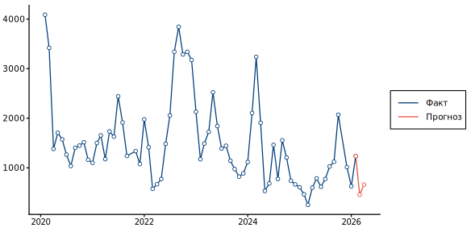

## План презентации

<div class="title-lead" style="margin-top:0;margin-bottom:0.6em;">
Единая база данных, API и аналитические инструменты — когда официальные источники недоступны или запаздывают.
</div>

<div class="agenda-grid">

<div class="agenda-card">
<span class="agenda-num">01</span>
<strong>Проблема</strong>
Почему недостаточно данных ФТС и чем это грозит аналитике внешней торговли?
</div>

<div class="agenda-card accent">
<span class="agenda-num">02</span>
<strong>Суть проекта</strong>
Архитектура, гармонизация источников, API и расчёт физических объёмов торговли, наукаст, аналитика.
</div>

<div class="agenda-card">
<span class="agenda-num">03</span>
<strong>Сравнение с другими веб-интерфейсами</strong>
Ключевые преимущества перед альтернативами (Trademap и Comtrade).
</div>

</div>

<div class="agenda-footnote">
Выпуск включает сравнение с альтернативными источниками и блок аналитики: бюллетень, физобъёмы, структура экспорта, nowcast.
</div>

```{r}
#| include: false
#| warning: false
#| message: false

library(arrow)
library(stringi)
library(htmltools)
library(htmlwidgets)

bulletin_fo <- arrow::read_parquet("../site/data/bulletin_fo.parquet")
report_month <- stri_datetime_format(max(bulletin_fo$PERIOD), format = "LLLL yyyy", locale = "ru")

inline_charts <- isTRUE(params$inline_charts) ||
  identical(Sys.getenv("QUARTO_PROFILE"), "dist")

chart_slide <- function(rds_path, iframe_src, title) {
  if (inline_charts) {
    div(
      class = "chart-frame-wrap chart-inline",
      readRDS(rds_path)
    )
  } else {
    HTML(sprintf(
      '<div class="chart-frame-wrap"><iframe src="%s" class="chart-frame" title="%s"></iframe></div>',
      iframe_src,
      title
    ))
  }
}
```

## {background-color="#003d7a" .section-slide}

<div class="section-number">01 · мотивация</div>

<div class="section-title">Недоступность актуальных данных ФТС</div>

<div class="section-tagline">
Официальная таможенная статистика России перестала публиковаться в привычном открытом формате — аналитикам приходится искать обходные пути.
</div>

## Что изменилось с данными ФТС?

::: {.incremental}
- **Архив** официальной статистики ФТС доступен за ограниченный период (2014–2022)
- **Оперативные** месячные данные по детализированной номенклатуре **не публикуются**
- Для текущего анализа нельзя опереться на «золотой стандарт» российской таможенной статистики
- Растёт спрос на **альтернативные источники**: зеркальная статистика, UN Comtrade, коммерческие платформы
:::

::: {.slide-takeaway}
**Появился запрос:** исследователям нужна инфраструктура, которая **собирает**, **сверяет** и **гармонизирует** данные — а не разовая выгрузка из веб-интерфейса.
:::

## Последствия для аналитики

<div class="split-panels">

<div class="split-panel negative">
<span class="panel-label">Проблема</span>
<h3>Без системного подхода</h3>
<ul>
<li>ручная склейка <strong>CSV и Excel</strong></li>
<li>разные классификации и <strong>лаги публикации</strong></li>
<li>невозможность <strong>масштабировать</strong> выборки</li>
<li>риск ошибок при <strong>сверке источников</strong></li>
</ul>
</div>

<div class="split-divider"></div>

<div class="split-panel positive">
<span class="panel-label">Решение</span>
<h3>Что нужно на практике</h3>
<ul>
<li><strong>единая структура</strong> данных по странам и ТН ВЭД</li>
<li><strong>прозрачность</strong> происхождения данных</li>
<li><strong>автоматическое</strong> обновление и воспроизводимость</li>
<li><strong>аналитика</strong> и поддержка качества данных</li>
</ul>
</div>

</div>

## {background-color="#003d7a" .section-slide}

<div class="section-number">02 · решение</div>

<div class="section-title">Актуальная статистика внешней торговли</div>

<div class="section-tagline">
Программный комплекс для сбора, гармонизации и предоставления торговой статистики России на основе зеркальных данных стран-партнёров.
</div>

## Что мы предлагаем

<div class="feature-grid">

<div class="feature-card accent">
<strong>Гармонизированная база DuckDB</strong>
Согласованные поля: страны, ТН ВЭД, периоды, стоимость и физические объёмы. Единая структура для всех источников.
<span class="chip">SQL · Parquet · CSV</span>
</div>

<div class="feature-card">
<strong>Мульти-источниковый синтез</strong>
Национальная статистика партнёров, UN Comtrade и архив ФТС — с приоритетом источников и флагом верификации.
<span class="chip">ФТС → нац. стат. → Comtrade</span>
</div>

<div class="feature-card accent">
<strong>Расчёт физобъёмов торговли</strong>
Восстановление пропусков, 12-месячные агрегаты и индексы физических объёмов на уровнях 2/4/6 знаков ТН ВЭД — редкий показатель, которого нет в большинстве веб-сервисов.
<span class="chip">тонны · штуки · м³</span>
</div>

<div class="feature-card">
<strong>Python API и аналитика</strong>
Пакетные запросы, дашборды, nowcast на основе FAVAR и готовые отчёты — данные и инструменты в одном контуре.
<span class="chip">API · Superset · FAVAR</span>
</div>

</div>

## Архитектура решения {.slide-diagram}

```{mermaid}
%%| fig-width: 11
%%| fig-height: 5.8
flowchart LR
    subgraph sources["📥 Источники данных"]
        direction TB
        A[" Китай/Индия/Турция - нац. статистика<br/><i>оперативно · детально</i>"]
        B["🏛️ Архив ФТС<br/><i>верификация 2014–2022</i>"]
        C["🌐 UN Comtrade<br/><i>заполнение пробелов</i>"]
    end

    subgraph etl["⚙️ ETL · ядро системы"]
        direction TB
        D["Автосбор<br/>collectors"]
        E["Гармонизация<br/>+ верификация"]
    end

    subgraph storage["💾 Единая база"]
        F[("harmonized<br/><b>DuckDB</b>")]
    end

    subgraph access["🚀 Для пользователя"]
        direction TB
        G["Python API"]
        H["Дашборды"]
        I["Физобъёмы · FAVAR"]
    end

    A --> D
    B --> D
    C --> D
    D --> E --> F
    F --> G & H & I

    style F fill:#003d7a,color:#fff,stroke:#e74c3c,stroke-width:3px
    style G fill:#e8f4fd,color:#003d7a,stroke:#003d7a
    style H fill:#e8f4fd,color:#003d7a,stroke:#003d7a
    style I fill:#fdecea,color:#c0392b,stroke:#e74c3c
    style E fill:#f0fff4,color:#1e7a45,stroke:#27ae60
```

::: {.slide-takeaway}
Каждая запись хранит **источник** и флаг **верификации** — видно, откуда цифра и подтверждена ли она зеркальной статистикой.
:::

## Ключевые особенности данных

::: {.incremental}
- **Физические объёмы** - не только USD, но и тонны, штуки, кубометры; восстановление пропусков
- **Индексы физических объёмов** на уровнях 2/4/6 знаков ТН ВЭД и по странам-партнёрам
- **Гармонизация** — единые коды стран, согласование единиц измерения
- **Nowcast (FAVAR)** — оперативные оценки при задержке официальной статистики
- **Актуальность** — данные зеркальной статистики обновляются регулярно и часто доступны раньше, чем на других ресурсах (например, UN Comtrade)
:::

## {background-color="#003d7a" .section-slide}

<div class="section-number">03 · сравнение</div>

<div class="section-title">Почему не TradeMap?</div>

<div class="section-tagline">
TradeMap — популярный веб-инструмент ITC, но для серьёзной аналитики и автоматизации он быстро упирается в ограничения интерфейса.
</div>

## Ландшафт источников данных {.slide-sources}

<div class="source-grid">

<div class="source-card">
<span class="tag">Веб-платформа</span>
<div class="card-title">TradeMap</div>
<div class="card-body">Справочная витрина ITC для обзорной торговой статистики.</div>
<div class="card-spec">
HS до 6 знаков · стоимость в USD · без национальной номенклатуры (ТН ВЭД-8/10). Источник цифры и степень проверки не прозрачны.
</div>
<ul class="card-list">
<li>только браузер, без API</li>
<li>лимиты на выгрузку</li>
<li>нет гармонизации источников</li>
<li>нет физобъёмов и nowcast</li>
</ul>
<div class="card-verdict weak">Подходит для разовых запросов</div>
</div>

<div class="source-card">
<span class="tag">Международный архив</span>
<div class="card-title">UN Comtrade</div>
<div class="card-body">Глобальный архив сырой внешнеторговой статистики ООН.</div>
<div class="card-spec">
Потоки reporter ↔ partner · 200+ стран. Физические единицы есть не по всем позициям. Опечатки в данных не устраняются.
</div>
<ul class="card-list">
<li>лимиты API и задержки</li>
<li>разные форматы и лаги</li>
<li>нужна ручная сверка</li>
<li>нет готовой аналитики</li>
</ul>
<div class="card-verdict mid">Не готовое решение</div>
</div>

<div class="source-card highlight">
<span class="tag">★ Наша платформа</span>
<div class="card-title">МГИМО Trade DB</div>
<div class="card-body">Готовая база для регулярного анализа внешней торговли России.</div>
<div class="card-spec">
Фокус: РФ × партнёры · месячная детализация · Китай, Индия, Турция + Comtrade + архив ФТС. Приоритет источников и источник происхождения каждой записи.
</div>
<ul class="card-list">
<li><strong>API + SQL</strong> — автоматизация</li>
<li><strong>гармонизация</strong> ФТС + партнёры + Comtrade</li>
<li><strong>физобъёмы</strong> и индексы объёмов</li>
<li><strong>FAVAR nowcast</strong> + дашборды</li>
</ul>
<div class="card-verdict">Лучший выбор для регулярной аналитики</div>
</div>

</div>

## Почему TradeMap хуже?{.slide-compare-table}

<table class="compare-table">
<thead>
<tr>
<th class="col-criterion"></th>
<th class="col-them">TradeMap</th>
<th class="col-us">МГИМО Trade DB</th>
</tr>
</thead>
<tbody>
<tr class="group-row"><td colspan="3">Доступ и интеграция</td></tr>
<tr>
<td class="criterion">Программный API</td>
<td class="cell-no"><span class="mark-no">✗</span> только браузер</td>
<td class="cell-us"><span class="mark-yes">✓</span> Python API</td>
</tr>
<tr>
<td class="criterion">Массовые выгрузки</td>
<td class="cell-no">лимиты интерфейса</td>
<td class="cell-us"><span class="mark-yes">✓</span> без ограничений GUI</td>
</tr>
<tr>
<td class="criterion">Сложные срезы</td>
<td class="cell-no">ручные сессии</td>
<td class="cell-us"><span class="mark-yes">✓</span> пакетные запросы</td>
</tr>
<tr class="group-row"><td colspan="3">Данные</td></tr>
<tr>
<td class="criterion">Гармонизация источников</td>
<td class="cell-mid">частично</td>
<td class="cell-us"><span class="mark-yes">✓</span> ФТС + ЗС + Comtrade</td>
</tr>
<tr>
<td class="criterion">Детализация номенклатуры</td>
<td class="cell-mid">HS до 6 знаков</td>
<td class="cell-us">ТН ВЭД 2–10</td>
</tr>
<tr>
<td class="criterion">Физические объёмы</td>
<td class="cell-mid">частично</td>
<td class="cell-us"><span class="mark-yes">✓</span> + индексы физобъёмов</td>
</tr>
<tr>
<td class="criterion">Прозрачность источника</td>
<td class="cell-no"><span class="mark-no">✗</span></td>
<td class="cell-us"><span class="mark-yes">✓</span> у каждой записи</td>
</tr>
<tr class="group-row"><td colspan="3">Аналитика</td></tr>
<tr>
<td class="criterion">SQL и агрегации</td>
<td class="cell-no"><span class="mark-no">✗</span></td>
<td class="cell-us"><span class="mark-yes">✓</span> DuckDB</td>
</tr>
<tr>
<td class="criterion">Дашборды и отчёты</td>
<td class="cell-mid">базовые графики</td>
<td class="cell-us"><span class="mark-yes">✓</span> Superset + отчёты</td>
</tr>
<tr>
<td class="criterion">Nowcast</td>
<td class="cell-no"><span class="mark-no">✗</span></td>
<td class="cell-us"><span class="mark-yes">✓</span> FAVAR</td>
</tr>
</tbody>
</table>

## {background-color="#003d7a" .section-slide}

<div class="section-number">04 · аналитика</div>

<div class="section-title">От данных к выводам</div>

<div class="section-tagline">
Ежемесячный бюллетень, индексы физобъёмов, структурный анализ внешней торговли и оперативный nowcast.
</div>

## Физические объёмы торговли {.slide-chart-hero}

<div class="chart-slide-header">
<span class="chart-tag">Ежемесячный бюллетень</span>
<span class="chart-title">Изменение физобъёма год к году, %</span>
<span class="chart-period">`r report_month`</span>
</div>

<div class="insight-bar insight-bar-before-chart">
<div class="insight-item"><strong>Турция</strong> — сжатие торговли с ноября 2023 г.</div>
<div class="insight-item"><strong>Индия</strong> — экспорт −12,5% г/г, в основном нефть и нефтепродукты</div>
<div class="insight-item"><strong>Китай</strong> — импорт +12%, экспорт +2% по объёму</div>
</div>

```{r}
#| echo: false
#| results: asis
chart_slide(
  "figures/bulletin/fizob.rds",
  "figures/bulletin/fizob.html",
  "Физические объёмы торговли"
)
```

## Индекс физобъёма: зачем и как

<div class="trio-panels">

<div class="trio-panel trio-negative">
<span class="panel-label">Проблема</span>
<h3>Разные единицы в одной группе</h3>
<p>В группе 22 (напитки) — декалитры пива, литры воды, упаковки в штуках. Сложить их напрямую нельзя: это не покажет, растёт ли <strong>объём</strong> торговли группой.</p>
</div>

<div class="trio-panel trio-neutral">
<span class="panel-label">Решение</span>
<h3>Индекс <code>физобъёмов</code></h3>
<ul>
<li>согласуем единицы, убираем артефакты сырых данных</li>
<li>12-месячные окна — без сезонных скачков</li>
<li>динамика % г/г по странам и уровням ТН ВЭД</li>
</ul>
</div>

<div class="trio-panel trio-positive">
<span class="panel-label">Зачем</span>
<h3>Объём ≠ цена в $</h3>
<p>Индекс отвечает: «стало больше или меньше груза?» — по экспорту и импорту, партнёрам и номенклатуре. В TradeMap такого нет.</p>
</div>

</div>

## Структура экспорта: нефтегаз и прочее {.slide-chart-hero}

<div class="chart-slide-header">
<span class="chart-tag">Структурный анализ</span>
<span class="chart-title">Экспорт в стоимостном выражении, млрд $</span>
<span class="chart-period">нефтегазовый сегмент vs прочие товары · `r report_month`</span>
</div>

<div class="insight-bar insight-bar-before-chart insight-bar-accent">
<div class="insight-item"><strong>Китай и Индия</strong> — ядро нефтегазового экспорта</div>
<div class="insight-item"><strong>Ненефтегаз</strong> — своя динамика, теряется в общем агрегате</div>
<div class="insight-item"><strong>2026</strong> — сохранится ли география потоков?</div>
</div>

```{r}
#| echo: false
#| results: asis
chart_slide(
  "figures/bulletin/oil_nonoil.rds",
  "figures/bulletin/oil_nonoil.html",
  "Нефтегаз и прочий экспорт"
)
```

## Nowcast (FAVAR) {.slide-nowcast}

<div class="nowcast-layout">

<div class="nowcast-grid">

<div class="nowcast-card nowcast-card--warn">
<p class="nowcast-headline"><span class="nowcast-ix">01 ·</span> Данных ещё нет — решения нужны</p>
<ul class="nowcast-points">
<li>Таможенные службы разных стран предоставляют данные неравномерно.</li>
<li>Даже если обновлять данные каждый день — лаг всё равно будет.</li>
<li>Это не позволяет оперативно анализировать агрегированный экспорт и импорт и часто приводит к ошибкам в преобразованиях данных.</li>
</ul>
</div>

<div class="nowcast-card">
<p class="nowcast-headline"><span class="nowcast-ix">02 ·</span> Модель FAVAR</p>
<ul class="nowcast-points">
<li>Факторная модель по группам ТН ВЭД и направлению.</li>
<li>Модель учитывает исторические закономерности и связи в импорте/экспорте различных товарных групп, временные лаги и распределение объёмов торговли по странам-партнёрам.</li>
</ul>
</div>

<div class="nowcast-card nowcast-card-highlight">
<p class="nowcast-headline"><span class="nowcast-ix">03 ·</span> Фактические значения и наукаст в одной базе</p>
<ul class="nowcast-points">
<li>Наукаст отмечен в базе данных отдельным флагом для удобства использования.</li>
<li>Наукаст охватывает все уровни (HS2/4/6), страны и товарные группы (<span class="nowcast-em">даже самые маленькие</span>)</li>
</ul>
</div>

</div>

<div class="nowcast-chart-block">
<div class="chart-slide-header nowcast-chart-header">
<span class="chart-tag">Nowcast включает даже малые группы · пример</span>
<span class="chart-title">Импорт напитков из Испании · ТН ВЭД 22 </span>
<span class="chart-period">тыс. т</span>
</div>
<div class="nowcast-figure-wrap">

</div>
</div>

</div>

## {background-color="#003d7a" .center-slide}

<div class="continue-note">
<span class="continue-title">Национальная торговая статистика</span>
База данных · API · бюллетень · аналитика
<span class="continue-sub">dd.mgimo.ru/trade</span>
</div>
