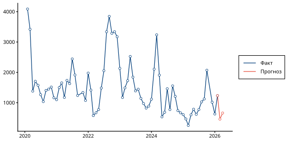

```{r}
#| include: false
#| warning: false
#| message: false

library(arrow)
library(stringi)
library(htmltools)
library(htmlwidgets)

bulletin_fo <- arrow::read_parquet("../site/data/bulletin_fo.parquet")
report_month <- stri_datetime_format(max(bulletin_fo$PERIOD), format = "LLLL yyyy", locale = "ru")

inline_charts <- isTRUE(params$inline_charts) ||
  identical(Sys.getenv("QUARTO_PROFILE"), "dist")

chart_slide <- function(rds_path, iframe_src, title) {
  if (inline_charts) {
    div(
      class = "chart-frame-wrap chart-inline",
      readRDS(rds_path)
    )
  } else {
    HTML(sprintf(
      '<div class="chart-frame-wrap"><iframe src="%s" class="chart-frame" title="%s"></iframe></div>',
      iframe_src,
      title
    ))
  }
}
```

## О чём пойдёт речь

::: {.lead}
Единая база внешней торговли России, собранная по статистике стран-партнёров, и три способа с ней работать: дашборд, Excel и API.
:::

<ol class="numbered"><li>Кому и для каких решений это нужно.</li><li>Что мы собрали: источники, гармонизация, физические объёмы, оценка за неотчитавшиеся месяцы.</li><li>Чем отличаемся от TradeMap и UN Comtrade.</li><li>Как вы получаете данные и на каких условиях.</li></ol>

## {background-color="#003d7a" .section-slide}

<div class="section-number">01</div>

<div class="section-title">Зачем это понадобилось</div>

<div class="section-tagline">
Официальная таможенная статистика России перестала публиковаться в привычном виде, а решения принимать нужно.
</div>

## Что изменилось с данными ФТС

::: {.incremental}
- Архив официальной статистики доступен за ограниченный период, 2014–2022 годы
- Оперативные месячные данные по детализированной номенклатуре не публикуются
- Опереться на «золотой стандарт» российской таможенной статистики в текущем анализе нельзя
- Спрос сместился к альтернативным источникам: зеркальная статистика партнёров, UN Comtrade, коммерческие платформы
:::

::: {.concl}
Разовая выгрузка из веб-интерфейса эту задачу не закрывает. Нужна инфраструктура, которая собирает данные регулярно, сверяет их между источниками и приводит к сопоставимому виду.
:::

## Что это значит на практике

:::: {.cols-2}

::: {.c}
[Если собирать самостоятельно]{.ch}

- выгрузки из разных источников в несовместимых форматах
- у каждой страны свои обозначения, единицы и сроки публикации
- ручная склейка и постоянная сверка
- при уходе исполнителя повторить некому
:::

::: {.c}
[Что требуется на деле]{.ch}

- единая структура по всем странам и товарным кодам
- прозрачное происхождение каждой цифры
- обновление и контроль качества на регулярной основе
- возможность выгрузить срез в свой инструмент
:::

::::

::: {.concl}
Эту работу мы берём на себя и отдаём результат в готовом виде: собранную, сверенную и гармонизированную базу с русскими названиями стран и товарных кодов.
:::

## {background-color="#003d7a" .section-slide}

<div class="section-number">02</div>

<div class="section-title">Что мы собрали</div>

<div class="section-tagline">
База внешней торговли России по данным стран-партнёров: 7,4 млн строк, 141 страна, помесячно с 2019 года.
</div>

## Кому и для каких решений

:::: {.cols-3}

::: {.c}
[Импортёрам и экспортёрам]{.ch}
Оценить ёмкость рынка по конкретной товарной позиции, найти поставщиков и покупателей, увидеть, кто ещё возит этот товар и в каких объёмах.

*Вопрос:* сколько этого товара реально ввозится и из каких стран.
:::

::: {.c}
[Логистическим компаниям]{.ch}
Спрогнозировать объёмы перевозок по направлениям и видам грузов, планировать мощности под реальные тоннажи, а не под стоимостные оценки.

*Вопрос:* сколько груза пойдёт по направлению в следующем квартале.
:::

::: {.c}
[Аналитикам и банкам]{.ch}
Строить макроэкономические модели на месячных данных, оценивать импортозамещение, отслеживать отрасли с растущими физическими объёмами.

*Вопрос:* какие отрасли растут в натуральном выражении, а не в деньгах.
:::

::::

::: {.concl}
Общее у всех трёх сценариев одно: нужны месячные данные в разрезе стран и товарных кодов, причём не только в долларах, но и в натуральных единицах.
:::

## Из чего состоит платформа

<table class="plain"><thead><tr><th>Составляющая</th><th>Что это даёт</th></tr></thead><tbody><tr><td>Гармонизированная база</td><td>согласованные страны, товарные коды, периоды, стоимость и натуральные единицы в одной структуре</td></tr><tr><td>Несколько источников</td><td>национальная статистика Китая, Индии и Турции, UN Comtrade для остальных стран, архив ФТС для сверки</td></tr><tr><td>Индексы физических объёмов</td><td>динамика натуральных объёмов на уровнях 2, 4 и 6 знаков ТН ВЭД — показателя нет ни в TradeMap, ни в Comtrade</td></tr><tr><td>Оценка за неотчитавшиеся месяцы</td><td>наукаст на основе факторной модели, помеченный в данных отдельным флагом</td></tr><tr><td>Доступ</td><td>дашборд, выгрузка в Excel без программирования, API для интеграции</td></tr></tbody></table>

## Как устроен сбор данных {.slide-diagram}

```{mermaid}
%%| fig-width: 11
%%| fig-height: 4.6
flowchart LR
    A["Китай · Индия · Турция<br/>национальная статистика"] --> D
    B["UN Comtrade<br/>остальные страны"] --> D
    C["Архив ФТС<br/>сверка 2014–2022"] --> D
    D["Сбор и гармонизация"] --> E
    E[("unified_trade_data<br/>7,4 млн строк")]
    E --> F["Дашборд"]
    E --> G["Excel"]
    E --> H["API"]

    classDef plain fill:#ffffff,stroke:#8a95a3,stroke-width:1px,color:#2c3e50
    class A,B,C,D,F,G,H plain
    style E fill:#ffffff,stroke:#003d7a,stroke-width:2px,color:#003d7a
```

::: {.concl}
У каждой записи сохраняется источник, из которого она пришла. Если по стране есть национальная статистика, данные Comtrade по ней не берутся — это исключает двойной счёт.
:::

## Особенности данных

::: {.incremental}
- **Физические объёмы** — не только доллары, но и килограммы, штуки, литры; пропуски восстанавливаются
- **Индексы физических объёмов** по странам и уровням ТН ВЭД: показывают динамику груза, очищенную от изменения цен
- **Гармонизация** — единые коды стран и согласованные единицы измерения между источниками
- **Наукаст** — оценка за месяцы, по которым отчётность ещё не пришла, помеченная флагом `TYPE = 'pred'`
- **Русские названия** товарных кодов и стран приходят вместе с данными
:::

## Почему этим данным можно верить

:::: {.cols-3}

::: {.c}
[Видно происхождение]{.ch}
У каждой записи хранится источник и признак «факт или оценка». Всегда можно ответить, откуда взялась конкретная цифра и не является ли она модельной.
:::

::: {.c}
[Проверки перед публикацией]{.ch}
После каждой пересборки база проходит автоматические SQL-проверки. Если они не пройдены, версия не публикуется на дашборд.
:::

::: {.c}
[Сомнительное помечается]{.ch}
Аномальные значения не удаляются молча: они отмечаются, чтобы было видно, где показатель вызывает вопросы, а где данные надёжны.
:::

::::

::: {.concl}
Отдельно ведётся учёт того, что и когда было загружено: по каждому месяцу известно, какие страны в нём есть и какая у их выгрузки контрольная сумма. Страны правят отчётность годами, и без такого учёта незаметно разъезжаются цифры за прошлые периоды.
:::

## {background-color="#003d7a" .section-slide}

<div class="section-number">03</div>

<div class="section-title">На фоне альтернатив</div>

<div class="section-tagline">
TradeMap и UN Comtrade решают свои задачи. Мы делаем то, чего в них нет: регулярность, натуральные объёмы и программный доступ.
</div>

## Три источника и их назначение

<table class="plain"><thead><tr><th></th><th>TradeMap</th><th>UN Comtrade</th><th>Наша платформа</th></tr></thead><tbody><tr><td>Что это</td><td>справочная витрина ITC</td><td>глобальный архив ООН</td><td>готовая база для регулярной работы</td></tr><tr><td>Детализация</td><td>HS до 6 знаков</td><td>HS до 6 знаков</td><td>ТН ВЭД до 10 знаков</td></tr><tr><td>Натуральные объёмы</td><td>частично</td><td>не по всем позициям</td><td>плюс индексы физобъёмов</td></tr><tr><td>Программный доступ</td><td>нет, только браузер</td><td>API с лимитами</td><td>API и OData для Excel</td></tr><tr><td>Происхождение цифры</td><td>не раскрывается</td><td>сырьё как есть</td><td>источник у каждой записи</td></tr><tr><td>Готовность к работе</td><td>разовые запросы</td><td>требует сверки и чистки</td><td>данные пригодны сразу</td></tr></tbody></table>

::: {.concl}
Мы не заменяем Comtrade, а опираемся на него там, где нет национальных данных. Разница в том, что сборка, сверка и приведение к сопоставимому виду уже выполнены.
:::

## {background-color="#003d7a" .section-slide}

<div class="section-number">04</div>

<div class="section-title">Что видно в данных</div>

<div class="section-tagline">
Три примера из ежемесячного бюллетеня: динамика натуральных объёмов, структура экспорта и оценка за последние месяцы.
</div>

## Физические объёмы торговли

::: {.lead}
Изменение физического объёма год к году, `r report_month`
:::

```{r}
#| echo: false
#| results: asis
chart_slide(
  "figures/bulletin/fizob.rds",
  "figures/bulletin/fizob.html",
  "Физические объёмы торговли"
)
```

::: {.note}
Турция — сжатие с конца 2023 года, Индия — сокращение экспорта нефти, Китай — рост импорта при неизменном экспорте.
:::

## Зачем нужен индекс физобъёма

:::: {.cols-3}

::: {.c}
[В чём сложность]{.ch}
Внутри одной товарной группы единицы измерения разные: литры, кубометры, штуки, киловатт-часы. Сложить их напрямую нельзя — сумма не покажет, растёт ли объём торговли.
:::

::: {.c}
[Как считается]{.ch}
Каждая позиция нормируется к своему базовому периоду, агрегируются уже безразмерные величины, скользящее окно в 12 месяцев снимает сезонность.
:::

::: {.c}
[Что это даёт]{.ch}
Ответ на вопрос «груза стало больше или меньше» — отдельно от того, подорожал он или подешевел. По любой стране и любому уровню товарного кода.
:::

::::

::: {.concl}
Стоимость в долларах смешивает цену и объём. В 2022 году экспорт вырос на 70% в долларах и одновременно сократился в тоннах — и оба числа верны.
:::

## Структура экспорта: нефтегаз и прочее

::: {.lead}
Экспорт в стоимостном выражении, млрд долларов, `r report_month`
:::

```{r}
#| echo: false
#| results: asis
chart_slide(
  "figures/bulletin/oil_nonoil.rds",
  "figures/bulletin/oil_nonoil.html",
  "Нефтегаз и прочий экспорт"
)
```

::: {.note}
Китай и Индия — ядро нефтегазового экспорта. У остального экспорта своя динамика, и в суммарной линии она теряется.
:::

## Оценка за месяцы, по которым нет отчётности

:::: {.cols-2}

::: {.c}
[Почему это нужно]{.ch}
Таможенные службы разных стран отчитываются неравномерно, и по последним месяцам данных ещё нет. Решения при этом принимаются сейчас, а не когда придёт отчётность.

Факторная модель использует исторические связи между товарными группами, направлениями и странами, чтобы оценить недостающие месяцы.
:::

::: {.c}
[Как это подаётся]{.ch}
Оценка помечена отдельным флагом и охватывает все уровни детализации. Ниже — импорт напитков из Испании: модель работает и на небольших группах, а не только на крупных агрегатах.


:::

::::

::: {.concl}
Оценка нигде не выдаётся за факт: и в выгрузке, и в дашборде видно, где заканчиваются отчётные данные.
:::

## {background-color="#003d7a" .section-slide}

<div class="section-number">05</div>

<div class="section-title">Как вы получаете данные</div>

<div class="section-tagline">
Три способа под разные задачи: посмотреть глазами, работать в Excel без программирования, встроить в свою систему.
</div>

## Три способа под разные роли

<table class="plain"><thead><tr><th>Способ</th><th>Кому</th><th>Что нужно уметь</th></tr></thead><tbody><tr><td>Дашборд</td><td>руководителю, отраслевому аналитику</td><td>ничего: фильтры мышкой в браузере</td></tr><tr><td>Excel</td><td>аналитику, который живёт в таблицах</td><td>меню «Данные», без формул и кода</td></tr><tr><td>API</td><td>разработчику, интеграции с вашей системой</td><td>HTTP-запрос из Python, R или BI</td></tr></tbody></table>

::: {.concl}
Все три работают с одной и той же базой и одним личным ключом. Данные между способами не расходятся: это один источник, показанный тремя способами.
:::

## Дашборд

<table class="plain"><thead><tr><th>Вкладка</th><th>На какой вопрос отвечает</th></tr></thead><tbody><tr><td>Обзор</td><td>что происходит со стоимостью и объёмом торговли в целом, включая оценку за последние месяцы</td></tr><tr><td>География</td><td>как торговля распределена по странам, в долларах и в килограммах</td></tr><tr><td>Продукты</td><td>какие товарные группы дают основной объём</td></tr><tr><td>Покрытие</td><td>по каким странам и периодам данные вообще есть</td></tr><tr><td>Физобъемы</td><td>больше или меньше стало груза, по странам и товарным группам</td></tr></tbody></table>

::: {.note}
Фильтры сгруппированы по разделам: направление торговли, год, источник, страна из 141, товарная группа из 98, единица измерения. Товар можно искать по русскому названию, а не только по коду.
:::

## Excel: подключение занимает три шага

:::: {.cols-3}

::: {.c}
[1. Личный ключ]{.ch}
В кабинете нажать «Выпустить токен» и скопировать ключ. Ключ личный, показывается один раз, при утере перевыпускается там же.
:::

::: {.c}
[2. Подключить источник]{.ch}
Данные → Получить данные → Из других источников → **Из веб-канала OData**. Вставить адрес фида, в окне входа выбрать «Основной»: имя любое, пароль — ваш ключ.
:::

::: {.c}
[3. Выбрать таблицу]{.ch}
В навигаторе две таблицы: `trade` — стоимость, вес и количество, `fizob` — индекс физического объёма. Нажать **«Преобразовать данные»**, а не «Загрузить».
:::

::::

::: {.concl}
Дальше Excel работает как с обычной таблицей. Формулы и макросы не нужны, всё делается через меню.
:::

## Срез ставится мышкой, обновляется кнопкой

:::: {.cols-2}

::: {.c}
[Фильтры в редакторе запроса]{.ch}
Стрелка в заголовке столбца:

- `STRANA` — страна по ISO-коду: `CN`, `TR`, `DE`
- `PERIOD` — период: после даты или диапазон
- `NAPR` — направление: `ИМ` или `ЭК`
- `TNVED2`, `TNVED4` — товарная группа
:::

::: {.c}
[Дальше]{.ch}
Отбор идёт на сервере, в файл приезжает только нужный срез:

- «Обновить всё» — свежие данные по тем же фильтрам
- сменить срез можно правкой шага фильтра
- сводные таблицы и графики поверх продолжают работать
:::

::::

::: {.note}
Фильтр обязателен: в базе миллионы строк, и без отбора Excel будет тянуть всё. Это единственное, что нужно запомнить при первом подключении.
:::

## Что приходит в Excel

<table class="plain"><thead><tr><th>Поле</th><th>Что означает</th><th>Как использовать</th></tr></thead><tbody><tr><td>STOIM</td><td>стоимость, доллары США</td><td>складывается без ограничений</td></tr><tr><td>NETTO</td><td>вес нетто, килограммы</td><td>складывается без ограничений</td></tr><tr><td>KOL и EDIZM</td><td>количество и его единица измерения</td><td>суммируется только внутри одной единицы</td></tr><tr><td>TNVED_NAME</td><td>название товара по-русски</td><td>приходит рядом с кодом</td></tr><tr><td>SOURCE и TYPE</td><td>источник и признак «факт или оценка»</td><td>видно, где наукаст</td></tr><tr><td>idx</td><td>индекс физобъёма в таблице fizob</td><td>динамика без влияния цен</td></tr></tbody></table>

::: {.concl}
Названия товаров приходят вместе с данными. Вести у себя справочник ТН ВЭД и сопоставлять коды вручную не нужно.
:::

## API для интеграции

:::: {.cols-2}

::: {.c}
[Два формата на выбор]{.ch}
REST с JSON и CSV — для скриптов на Python и R. OData-фид — для Excel и Power BI без единой строки кода. Авторизация в обоих случаях одним и тем же личным ключом.

Интерактивная документация со схемой всех параметров открывается в браузере.
:::

::: {.c}
[Фильтрация и агрегация на сервере]{.ch}
Страна, направление, период, уровень товарного кода, единица измерения. Можно запросить готовые суммы в нужном разрезе, а не выкачивать сырые строки и агрегировать у себя.

Справочники стран и кодов ТН ВЭД с русскими названиями отдаются отдельными запросами — для выпадающих списков в вашем интерфейсе.
:::

::::

::: {.note}
Сейчас API работает в пилотном режиме: доступ выдаётся по согласованию и ограничен на уровне сети.
:::

## Условия доступа

:::: {.cols-3}

::: {.c}
[Сейчас: пилот, бесплатно]{.ch}
На период пилотной эксплуатации доступ предоставляется бесплатно — дашборд, выгрузка в Excel и API. Ограничения на этом этапе щадящие: месячной квоты нет.
:::

::: {.c}
[Дальше: коммерческий доступ]{.ch}
После пилота предполагается платный доступ. Бесплатный уровень сохранится, но с ограниченными лимитами по частоте запросов, месячному объёму и размеру выгрузки. Условия определяются.
:::

::: {.c}
[Без неожиданностей]{.ch}
Лимиты не наступают внезапно: текущий план и остаток месячной квоты видны в самом API. При исчерпании сервис отвечает понятной ошибкой с указанием, когда можно повторить запрос.
:::

::::

::: {.concl}
Пилот — возможность проверить данные на своих задачах до всяких обязательств: взять свой срез, сверить с тем, что вы знаете о рынке, и уже потом решать.
:::

## {background-color="#003d7a" .center-slide}

<div class="continue-note">
<span class="continue-title">С чего начать</span>
На период пилота доступ бесплатный: дашборд, Excel и API
<span class="continue-sub">quantviews.github.io/mgimo-foreign-trade</span>
</div>

<div class="cta-row"><div><span class="cta-num">1</span>Называете страны и товарные группы, которые вам интересны</div><div><span class="cta-num">2</span>Присылаем Excel-файл с этим срезом и личный ключ</div><div><span class="cta-num">3</span>Обновляете данные кнопкой и решаете, нужен ли доступ дальше</div></div>
