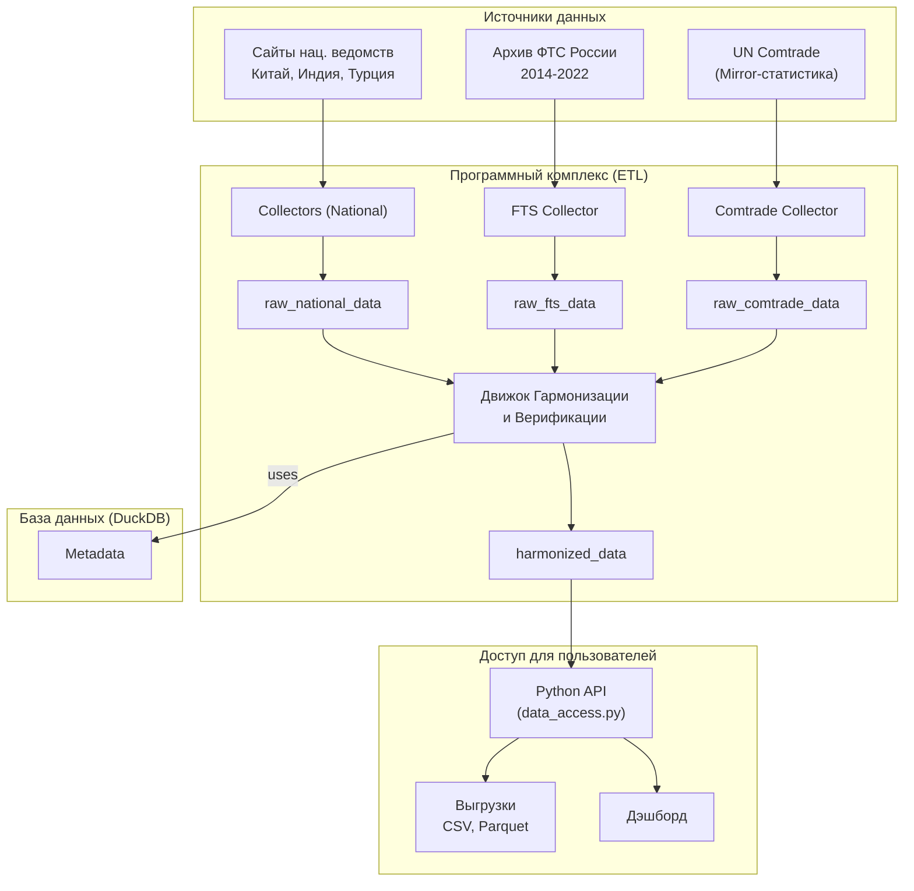

# Архитектура проекта «Актуальная статистика внешней торговли» (МГИМО)

Ахитектура проекта не является конечной и обновляется.

Автор - Марсель Салихов (ИЭФ, ВШЭ).

---

## 1. Общее описание 

Центральным элементом системы является база данных `trade_statistics.duckdb`.

### Таблицы для "сырых" данных

*   **`raw_national_data`**: Для данных с сайтов национальных ведомств (Китай, Индия, Турция).
    *   `source_country`, `report_period`, `flow`, `commodity_code`, `partner_country`, `value_usd`, и т.д.

*   **`raw_fts_data`**: Для прямых данных ФТС России.
    *   Структура максимально близка к исходным файлам ФТС для сохранения полноты.

*   **`raw_comtrade_data`**: Для зеркальных данных из UN Comtrade.
    *   Структура соответствует выгрузкам из Comtrade.

### Главная гармонизированная таблица

*   **`harmonized_data`**: Результат синтеза и верификации всех источников.
    *   `id`
    *   `year`, `month`
    *   `reporter_iso3`, `partner_iso3`
    *   `flow`
    *   `hs_code_2` (гармонизированный код HS на уровне 2 знака)
    *   `hs_code_4` (гармонизированный код HS на уровне 4 знака)
    *   `hs_code_6` (гармонизированный код HS на уровне 4 знака)
    *   `hs_code_8` (НЕ-гармонизированный код HS на уровне 4 знака)
    *   `hs_code_10`(НЕ-гармонизированный код HS на уровне 4 знака)
    *   `stoim`     (стоимость в долларах США)
    *   `netto`     (физический объем)
    *   `edizm`     (единица измерения физических единиц)
    *   **`data_source_priority` (INTEGER)**: Указатель на источник (1=ФТС, 2=Нац. стат., 3=Comtrade).
    *   **`is_verified` (BOOLEAN)**: Флаг, подтвержденный зеркальной статистикой.

---

## 2. Структура проекта 

```
trade_statistics_project/
├── data/
│   └── trade_statistics.duckdb
├── source_data/
│   ├── fts/
│   ├── comtrade/
│   ├── india/
│   ├── turkey/
│   └── china/
├── src/
│   ├── collectors/
│   │   ├── base_collector.py
│   │   ├── china_collector.py
│   │   ├── fts_collector.py
│   │   └── comtrade_collector.py
│   ├── processors/
│   │   └── harmonizer.py  # Код гармонизации и верификации данных
│   ├── database/
│   │   └── manager.py
│   ├── api/
│   │   └── data_access.py
│   └── config.py
└── main.py
```

### Описание модулей:

*   **`collectors`**: Модули для сбора данных из каждого источника (`fts_collector.py`, `comtrade_collector.py` и по одному на каждую страну).
*   **`processors/harmonizer.py`**: **Ядро системы.** Выполняет следующие шаги:
    1.  **Приоритезация источников**: Ищет данные для каждого торгового потока в порядке: ФТС -> Национальная статистика -> Comtrade.
    2.  **Верификация**: Сравнивает данные из разных источников и выставляет флаг `is_verified`.
    3.  **Заполнение пробелов**: Использует Comtrade для заполнения отсутствующих данных.
    4.  **Синтез**: Записывает наиболее достоверную цифру в итоговую таблицу `harmonized_data`.
*   **`database/manager.py`**: Единый модуль для работы с DuckDB.
*   **`api/data_access.py`**: Простой интерфейс для конечных пользователей для получения данных и выгрузок.
*   **`main.py`**: Скрипт-оркестратор, запускающий весь ETL-процесс.

---

## 3. Схема процесса (Workflow)



### Преимущества архитектуры:

1.  **Полнота**: Используются все доступные данные.
2.  **Надежность**: Данные ФТС как "стандарт" для верификации.
3.  **Прозрачность**: Возможность отследить источник каждой цифры.
4.  **Гибкость**: Доступ как к обработанным, так и к "сырым" данным.
