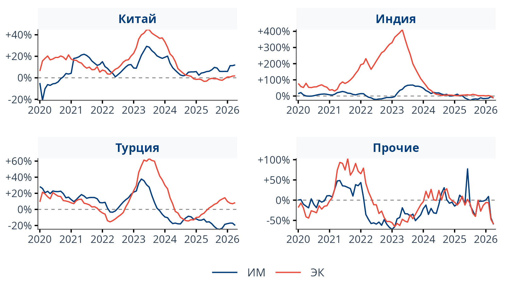
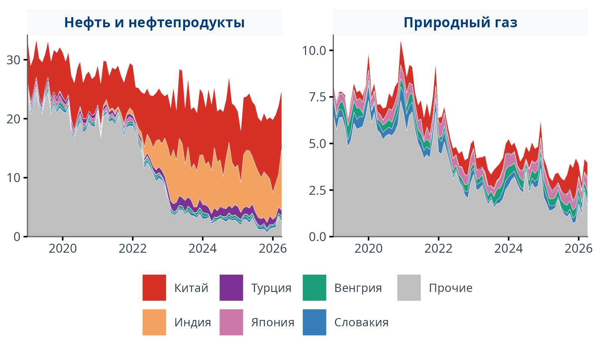

<div class="title-lead">
Готовая база данных о внешней торговле России: собрана по статистике стран-партнёров, приведена к единому виду и обновляется каждый месяц.
</div>

<div class="hero-chips">
<span class="chip">Китай, Индия, Турция + 138 стран</span>
<span class="chip">данные с 2019 года</span>
<span class="chip">обновление ежемесячно</span>
<span class="chip">физические объёмы и оперативный прогноз</span>
</div>

## Зачем это нужно

Оценка рынков, планирование поставок и анализ рисков опираются на свежие данные о внешней торговле — по конкретным товарам и странам, а не только по общим итогам. В готовом виде таких данных нет: их приходится собирать из разных национальных источников, у каждого из которых своя структура, свои единицы измерения и свои сроки публикации.

Свести всё это вручную — самостоятельная и трудоёмкая работа: согласовать классификации, перевести единицы и названия, ежемесячно обновлять данные и следить за их качеством. Эту работу мы берём на себя и отдаём результат в готовом виде.

<div class="split-panels">

<div class="split-panel negative">
<span class="panel-label">Собирать самостоятельно</span>
<h3>Много ручной работы</h3>
<ul>
<li>выгрузки из разных источников в несовместимых форматах</li>
<li>у каждой страны свои обозначения и единицы</li>
<li>разные сроки публикации и классификации</li>
<li>постоянная сверка и риск ошибок</li>
</ul>
</div>

<div class="split-divider"></div>

<div class="split-panel positive">
<span class="panel-label">Использовать готовую базу</span>
<h3>Данные сразу пригодны для анализа</h3>
<ul>
<li>единая структура по всем странам и товарам</li>
<li>единицы измерения в российском стандарте</li>
<li>русские названия товарных кодов</li>
<li>обновление и контроль качества — на нашей стороне</li>
</ul>
</div>

</div>

## Единая база данных

В основе проекта — база внешней торговли России, собранная из статистики стран-партнёров и дополненная международными данными для полноты картины. Оперативные и детализированные данные поступают из трёх стран: Китая, Индии и Турции. В дальнейшем мы планируем расширять перечень национальных источников.

<div class="db-stats">
<div class="db-stat db-stat-main">
<span class="db-stat-value">6,8 млн</span>
<span class="db-stat-label">строк · январь 2019 — апрель 2026</span>
</div>
<div class="db-stat">
<span class="db-stat-value">138</span>
<span class="db-stat-label">стран из базы ООН (Comtrade)</span>
</div>
</div>

<div class="db-stats-national">
<span class="db-stats-title">Национальные источники — статистика стран-партнёров</span>
<div class="db-stats-row">
<span><strong>Индия</strong> — 540 тыс.</span>
<span><strong>Китай</strong> — 471 тыс.</span>
<span><strong>Турция</strong> — 322 тыс.</span>
</div>
</div>

```{mermaid}
%%| fig-width: 11
%%| fig-height: 5
%%{init: {
  "theme": "base",
  "themeVariables": {
    "fontSize": "14px",
    "fontFamily": "Inter, Segoe UI, Arial, sans-serif",
    "primaryColor": "#ffffff",
    "primaryTextColor": "#2c3e50",
    "primaryBorderColor": "#c5dff5",
    "secondaryColor": "#e8f4fd",
    "secondaryTextColor": "#003d7a",
    "secondaryBorderColor": "#003d7a",
    "tertiaryColor": "#f0f5ff",
    "tertiaryTextColor": "#003d7a",
    "tertiaryBorderColor": "#c5dff5",
    "clusterBkg": "#f8f9fb",
    "clusterBorder": "#c5dff5",
    "lineColor": "#5a6a7a",
    "titleColor": "#003d7a"
  }
}}%%
flowchart LR
    subgraph sources["Источники"]
        direction TB
        A["Китай, Индия, Турция<br/><i>статистика стран-партнёров:<br/>оперативно и детально</i>"]
        C["База ООН (UN Comtrade)<br/><i>заполнение пробелов · 138 стран</i>"]
    end

    subgraph etl["Обработка"]
        direction TB
        D["Автоматический<br/>сбор"]
        E["Приведение<br/>к единому виду"]
    end

    subgraph storage["Единая база"]
        F[("Готовые<br/>данные")]
    end

    subgraph access["Доступ"]
        direction TB
        G["Выгрузки и API"]
        H["Дашборды"]
        I["Физобъёмы и прогноз"]
    end

    A --> D
    C --> D
    D --> E --> F
    F --> G & H & I

    style A fill:#ffffff,color:#2c3e50,stroke:#003d7a
    style C fill:#ffffff,color:#2c3e50,stroke:#c5dff5
    style D fill:#ffffff,color:#2c3e50,stroke:#c5dff5
    style F fill:#003d7a,color:#fff,stroke:#e74c3c,stroke-width:3px
    style G fill:#e8f4fd,color:#003d7a,stroke:#003d7a
    style H fill:#e8f4fd,color:#003d7a,stroke:#003d7a
    style I fill:#fdecea,color:#c0392b,stroke:#e74c3c
    style E fill:#f0fff4,color:#1e7a45,stroke:#27ae60
    style sources fill:#f8f9fb,stroke:#c5dff5,color:#003d7a
    style etl fill:#f8f9fb,stroke:#c5dff5,color:#003d7a
    style storage fill:#f8f9fb,stroke:#c5dff5,color:#003d7a
    style access fill:#f8f9fb,stroke:#c5dff5,color:#003d7a
```

<div class="slide-takeaway">
Для каждой записи сохраняется информация об источнике: видно, из национальной статистики какой страны или из какой международной базы получено значение.
</div>

## Как мы сводим данные воедино

Основная содержательная работа проекта — гармонизация. Данные из разных стран приходят в несовместимом виде, и мы приводим их к общему стандарту по трём направлениям.

<div class="feature-grid">

<div class="feature-card">
<strong>Единая структура</strong>
Страна, товар, период, стоимость и объём во всех источниках названы и устроены одинаково — данные разных стран можно сравнивать напрямую.
</div>

<div class="feature-card">
<strong>Российские единицы измерения</strong>
Тонны, штуки, литры и прочие единицы приведены к обозначениям, принятым в российской практике.
</div>

<div class="feature-card">
<strong>Русские названия товаров</strong>
Для кодов ТН ВЭД, у которых нет официального русского названия, мы подготовили перевод — таблицы читаются без обращения к внешним справочникам.
</div>

</div>

## Чего нет у других сервисов

Два показателя, которые сложно найти в готовом виде где-либо ещё.

<div class="feature-grid">

<div class="feature-card accent">
<strong>Физические объёмы</strong>
Торговлю обычно оценивают в стоимостном выражении, однако такие данные не позволяют отделить изменение физических объёмов от изменения цен. Мы восстанавливаем объёмы в натуральном выражении — тонны, штуки, кубометры — и строим по ним индексы на разных уровнях товарных групп. Это позволяет отделить рост цен от роста поставок.
</div>

<div class="feature-card accent">
<strong>Оперативный прогноз (nowcast)</strong>
Национальная статистика выходит с задержкой в несколько месяцев. Чтобы не ждать, мы оцениваем торговлю за последние месяцы статистической моделью. Такие оценки всегда помечены отдельным флагом — их видно и легко отделить от фактических данных.
</div>

</div>

## Форматы доступа

<div class="feature-grid">

<div class="feature-card">
<strong>Выгрузка базы</strong>
Полный срез данных за нужные периоды: готовые таблицы с одинаковыми полями по всем странам, товарные коды разной детализации, стоимость и физические объёмы.
</div>

<div class="feature-card">
<strong>Интерактивные дашборды</strong>
Графики и отчёты без ручных расчётов, с фильтрами по товарам, странам и периодам. Готовые представления можно настроить под конкретную задачу.
</div>

<div class="feature-card">
<strong>Отчёты под задачу</strong>
Excel-файлы в вашей структуре с автоматическим обновлением, включая специальные показатели и индексы физических объёмов.
</div>

</div>

## В сравнении с альтернативами

Для обзорных запросов есть привычные веб-инструменты — TradeMap и UN Comtrade. Для регулярной аналитики и автоматизации они быстро упираются в ограничения.

<div class="source-grid">

<div class="source-card highlight">
<div class="card-logos">


</div>
<span class="tag">Наш проект</span>
<div class="card-title">МГИМО / ИЭФ</div>
<div class="card-body">Готовая база для регулярного анализа внешней торговли России.</div>
<div class="card-spec">
Россия и её партнёры, помесячная детализация, Китай, Индия и Турция плюс данные ООН. У каждой записи видно происхождение.
</div>
<ul class="card-list">
<li>единый вид данных из разных стран</li>
<li>русские названия и привычные единицы</li>
<li>физобъёмы и индексы объёмов</li>
<li>оперативный прогноз и дашборды</li>
</ul>
<div class="card-verdict">Для регулярной аналитики</div>
</div>

<div class="source-card">
<span class="tag">Веб-платформа</span>
<div class="card-title">TradeMap</div>
<div class="card-body">Справочная витрина Международного торгового центра (ITC).</div>
<div class="card-spec">
Товарные коды до 6 знаков, стоимость в долларах, без подробной национальной номенклатуры. Источник данных и результаты их проверки не всегда прозрачны.
</div>
<ul class="card-list">
<li>только браузер, без автоматизации</li>
<li>лимиты на выгрузку</li>
<li>источники не сведены к единому виду</li>
<li>нет физобъёмов и прогноза</li>
</ul>
<div class="card-verdict weak">Для разовых запросов</div>
</div>

<div class="source-card">
<span class="tag">Международный архив</span>
<div class="card-title">UN Comtrade</div>
<div class="card-body">Глобальный архив первичной внешнеторговой статистики ООН.</div>
<div class="card-spec">
Данные по 200+ странам. Физические объёмы есть не по всем позициям, форматы и сроки различаются, ошибки в исходных данных не исправляются.
</div>
<ul class="card-list">
<li>ограничения и задержки доступа</li>
<li>разные форматы и сроки</li>
<li>требуется ручная сверка</li>
<li>нет готовой аналитики</li>
</ul>
<div class="card-verdict mid">Не готовое решение</div>
</div>

</div>

<table class="compare-table">
<thead>
<tr>
<th class="col-criterion"></th>
<th class="col-us">МГИМО / ИЭФ</th>
<th class="col-them">TradeMap</th>
</tr>
</thead>
<tbody>
<tr class="group-row"><td colspan="3">Доступ</td></tr>
<tr>
<td class="criterion">Автоматизация и API</td>
<td class="cell-us"><span class="mark-yes">✓</span> доступ по API</td>
<td class="cell-no"><span class="mark-no">✗</span> только браузер</td>
</tr>
<tr>
<td class="criterion">Массовые выгрузки</td>
<td class="cell-us"><span class="mark-yes">✓</span> без ограничений</td>
<td class="cell-no">лимиты интерфейса</td>
</tr>
<tr class="group-row"><td colspan="3">Данные</td></tr>
<tr>
<td class="criterion">Единый формат данных</td>
<td class="cell-us"><span class="mark-yes">✓</span> все страны в одном стандарте</td>
<td class="cell-mid">частично</td>
</tr>
<tr>
<td class="criterion">Детализация товаров</td>
<td class="cell-us">коды 2–10 знаков</td>
<td class="cell-mid">коды до 6 знаков</td>
</tr>
<tr>
<td class="criterion">Русские названия и единицы</td>
<td class="cell-us"><span class="mark-yes">✓</span> российский стандарт</td>
<td class="cell-no"><span class="mark-no">✗</span></td>
</tr>
<tr>
<td class="criterion">Физические объёмы</td>
<td class="cell-us"><span class="mark-yes">✓</span> + индексы физобъёмов</td>
<td class="cell-mid">частично</td>
</tr>
<tr>
<td class="criterion">Указан источник данных</td>
<td class="cell-us"><span class="mark-yes">✓</span> у каждой записи</td>
<td class="cell-no"><span class="mark-no">✗</span></td>
</tr>
<tr class="group-row"><td colspan="3">Аналитика</td></tr>
<tr>
<td class="criterion">Дашборды и отчёты</td>
<td class="cell-us"><span class="mark-yes">✓</span> дашборды и отчёты</td>
<td class="cell-mid">базовые графики</td>
</tr>
<tr>
<td class="criterion">Оперативный прогноз</td>
<td class="cell-us"><span class="mark-yes">✓</span> nowcast</td>
<td class="cell-no"><span class="mark-no">✗</span></td>
</tr>
</tbody>
</table>

## Примеры аналитики

На основе базы мы выпускаем ежемесячный бюллетень, считаем индексы физических объёмов и разбираем структуру экспорта.

<div class="analytics-preview">

<div class="analytics-card">
<span class="chart-tag">Ежемесячный бюллетень</span>
<strong>Изменение физического объёма год к году</strong>

</div>

<div class="analytics-card">
<span class="chart-tag">Структурный анализ</span>
<strong>Экспорт: нефтегаз и прочие товары</strong>

</div>

</div>

[Смотреть полный ежемесячный бюллетень →](bulletin_comparison.qmd){.btn .btn-primary .landing-cta}

## Как начать

<div class="cta-steps">

<div class="cta-step">
<span class="cta-num">1</span>
<strong>Свяжитесь с командой</strong>
<p>Укажите интересующие страны, товары и желаемый формат данных.</p>
<p class="cta-email"><a href="mailto:m_salihov@fief.ru">m_salihov@fief.ru</a></p>
</div>

<div class="cta-step">
<span class="cta-num">2</span>
<strong>Тестовый доступ</strong>
<p>На этапе запуска предоставляется бесплатно.</p>
</div>

<div class="cta-step">
<span class="cta-num">3</span>
<strong>Внедрение</strong>
<p>Помогаем встроить данные в ваши процессы и аналитику.</p>
</div>

</div>

::: {.callout-tip}
## Методология и техническая документация
Подробнее о том, как мы сводим источники, считаем индексы физических объёмов и строим оперативный прогноз — в [технической документации](technical.qmd).
:::
